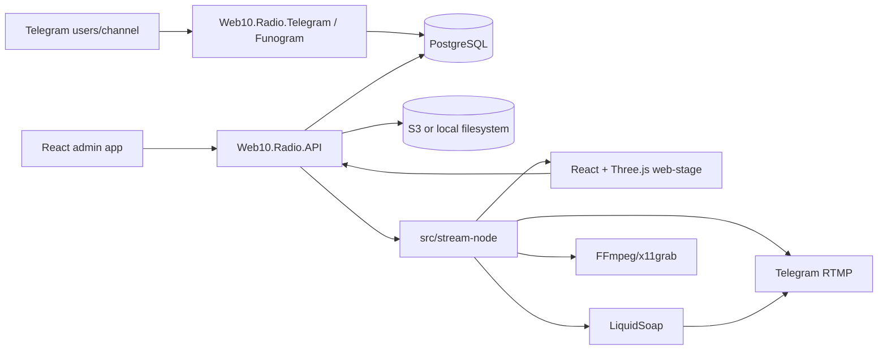

# Repository Guidelines

## Project Overview

Web10.Radio is intended to be a 24/7 Telegram-channel radio station for `@netscapedidnothingwrong` with a Web 1.0 / Aero visual identity: fullscreen 3D stage, retro overlay widgets, music playback, Telegram bot interactions, paid screen messages, donation goals, and admin moderation.

Current state: backend, frontend, and the F# stream-node runtime are implemented and building. `src/backend/` contains the API, standalone Telegram service, shared Application kernel, Database, Migrator, and NUnit/Testcontainers tests. `src/frontend/` is the Bun monorepo (`shared`, `web-stage`, `admin`); `src/stream-node/` contains the F# runtime and Tools projects. Telegram supports webhook and long polling (`WEB10_TELEGRAM__UPDATE_MODE`) and owns `/api/v0/telegram/*`; nginx proxies those routes to the Telegram container.

## Architecture & Data Flow

Target v0 architecture is defined in `docs/SPEC.md`; read it before implementing features.



Key architectural rules:

- Backend is split by deployable boundary: `Web10.Radio.API` owns player/admin/library/playback/stream-node routes and API workers; `Web10.Radio.Telegram` is a standalone Funogram executable owning Telegram ingress, Stars workflows, and its Telegram outbox relay.
- `Web10.Radio.Application` owns shared event envelopes, audience mapping, relay contracts, and health primitives; `Web10.Radio.Database` owns migrations, ADO.NET repositories, transaction helpers, and DB invariants.
- `src/stream-node/` is a separate F# container/process group for Xvfb + kiosk Chromium + LiquidSoap + FFmpeg/x11grab, then RTMP to Telegram; it is not a Python supervisor.
- Frontend is a Bun workspace under `src/frontend/` with `web-stage`, `admin`, and `shared` workspaces.
- Frontend consumes only the contract routes in `docs/SPEC.md`: `/api/v0/player/*` and `/api/v0/admin/*`; Telegram paths are reverse-proxy deployment routes, not API-owned handlers.
- Durable side effects use audience-partitioned `OutboxEvents`; API and Telegram relays claim only their own audience.
- Public stage data flow: `GET /api/v0/player/state` snapshot + `GET /api/v0/player/events` SSE deltas. After two SSE disconnects within 30 seconds, poll `/api/v0/player/state` every 5 seconds.

## Key Directories

- `docs/` — canonical product and implementation contracts.
  - `docs/SPEC.md` is the source of truth for architecture, API contracts, event model, config keys, DB invariants, and acceptance criteria.
  - `docs/PLAN-FRONTEND.md` is the checklist for `src/frontend/*`.
  - `docs/PLAN-BACKEND.md` is the checklist for `src/backend/*` and `src/stream-node/*`.
- `src/frontend/web-stage/mocks/` — read-only design handoff bundle for the public stage.
  - `project/Web 1.0 Radio Scene.dc.html` is the visual/behavioral reference.
  - `project/support.js` and `project/image-slot.js` are prototype runtime files; do not port them into production.
  - `project/uploads/` and `project/screenshots/` contain mock assets/reference images.
- `README.md` — current runtime, configuration, Compose smoke, and verification guide.
- `CLAUDE.md` — existing agent guidance and current-state guardrails; useful but keep `AGENTS.md` and `docs/SPEC.md` aligned when conventions change.
- `Web 1.0-radio-scene.zip` — duplicate wrapper around the mock assets, not a separate source of requirements.

Implemented source layout:

- `src/frontend/package.json`, `src/frontend/tsconfig.base.json`, and workspaces `shared`, `web-stage`, `admin`.
- `src/backend/Web10.Radio.sln` with API, Application, Database, Migrator, Telegram, and Tests projects.
- `src/stream-node/` with F# runtime, Tools project, Liquidsoap script, and Debian container.
- `compose.yaml` and Dockerfiles for PostgreSQL, migrator, API, Telegram, frontend, RTMP sink, and stream-node.

## Development Commands

Commands are real and run from repository root unless noted:

```sh
# Frontend
cd src/frontend
bun install
bun run typecheck
bun run build
bun run test

# Backend
cd src/backend
dotnet build Web10.Radio.sln
dotnet test Web10.Radio.sln --no-restore

# Compose smoke (use local RTMP overrides when .env points at Telegram)
cd ../..
WEB10_STREAM__RTMP_URL=rtmp://rtmp-sink:1935/s/ WEB10_STREAM__RTMP_KEY=compose-smoke-rtmp-key docker compose up --build --wait --wait-timeout 180
```

Expected command categories:

- Frontend: Bun workspace-level and per-app `typecheck`, `build`, and `test` scripts.
- Backend: `dotnet` CLI, F# projects, NUnit/Testcontainers integration tests.
- Stream-node: F# Tools smoke checks for Xvfb, Chromium, LiquidSoap, FFmpeg, playback controls, and backend heartbeat.
- Docker: container smoke path for PostgreSQL + migrator + API + Telegram + frontend + stream-node.


## Code Conventions & Common Patterns

### Frontend

- Use TypeScript `.ts`/`.tsx` only for authored source. No JavaScript source files.
- Enforce strict TypeScript: `strict: true`, `noImplicitAny`, `noUncheckedIndexedAccess`, and `exactOptionalPropertyTypes`.
- Do not author `any`, `unknown`, untyped API payloads, or type assertions that erase domain types.
- Put all DTO/domain contracts in `src/frontend/shared`, copied exactly from `docs/SPEC.md` field names and enum literals.
- Use Feature-Sliced Design layers only: `app`, `pages`, `widgets`, `features`, `entities`, `shared`. Imports flow high-to-low; `shared` imports no project domains. Do not use the deprecated `processes` layer.
- Recreate the mock stage in React + Three.js; do not embed the `.dc.html` prototype or port `support.js` / `image-slot.js`.
- Replace mock random timers with API/SSE state.
- Keep stage alive for empty arrays and `stream.status = "offline" | "degraded"`.
- React effects that start listeners, animation frames, textures, renderers, or other external resources must return cleanup.
- Handle `webglcontextlost` by preventing default and stopping the frame loop; handle `webglcontextrestored` by rebuilding renderer resources.
- Dispose Three.js renderer, geometries, materials, textures, event listeners, and animation frames on unmount.

### Backend

- Use F# for backend projects.
- Keep Telegram integration on Funogram.
- Use ADO.NET only for PostgreSQL access. No EF Core, Dapper, ORM, or object mapper in app persistence code.
- Use PostgreSQL migrations owned by `Web10.Radio.Database`.
- Use RFC9562 UUIDv7 IDs via Dodo.Primitives `Uuid`, stored as PostgreSQL `uuid`.
- Every mutable table has `IsDeleted`, `CreatedAtUtc`, and `UpdatedAtUtc`.
- Application code never `DELETE`s domain data. Soft delete with `UPDATE ... SET "IsDeleted" = true`.
- Normal reads filter `WHERE "IsDeleted" = false`; only explicit admin audit reads may include deleted rows.
- Queue/work claiming uses the `SELECT ... FOR UPDATE SKIP LOCKED` pattern from `docs/SPEC.md`.
- Config parsing/validation happens at startup and fails fast with actionable errors.
- Use constructor injection, scoped repositories/transactions for request work, and module registration functions for DI composition.
- Do not inject scoped services into singletons without an explicit scope factory.
- Use high-performance structured logging; avoid string interpolation in hot-path logs. Include `traceId`, `correlationId`, `eventId`, `telegramUpdateId`, and `queueItemId` where applicable.

### Payments and Events

- v0 payments are Telegram Stars only: currency `XTR`, `provider_token = ""`.
- Store money amounts as integer Stars, not cents.
- Answer Telegram `pre_checkout_query` within 10 seconds.
- Deliver paid effects only after `successful_payment`, not after pre-checkout approval.
- Store `telegram_payment_charge_id` for refunds.
- Do not implement USDT/card payments in v0.
- Deduplicate Telegram updates by `(telegramUpdateId, eventType)` before emitting domain events.
- Preserve event envelope fields from `docs/SPEC.md`: `eventId`, `eventType`, `occurredAtUtc`, `producer`, `correlationId`, `causationId`, `payload`.

## Important Files

- `docs/SPEC.md` — canonical contract. Start here for product behavior, routes, DTOs, events, DB rules, config, and QA expectations.
- `docs/PLAN-FRONTEND.md` — frontend implementation and verification checklist.
- `docs/PLAN-BACKEND.md` — backend, Telegram, persistence, observability, Docker, and stream-node checklist.
- `CLAUDE.md` — current-state architecture and development guidance; runtime/build artifacts are present.
- `src/frontend/web-stage/mocks/README.md` — design-handoff instructions.
- `src/frontend/web-stage/mocks/project/Web 1.0 Radio Scene.dc.html` — pixel/behavior reference: Three.js r128 scene, gradient sky, water shader, checker floor, temple, rotating CD jewel case, `web1radio.exe` loading window, overlay widgets, donation toast, `aero`/`win9x` themes, and `corners`/`sidebar`/`bottombar` layouts.
- `src/frontend/web-stage/mocks/project/support.js` — generated Design Canvas runtime, prototype-only.
- `src/frontend/web-stage/mocks/project/image-slot.js` — prototype custom element, prototype-only.

## Runtime/Tooling Preferences

- Frontend runtime/package manager: Bun, not npm/yarn/pnpm.
- Frontend stack: React + Three.js + strict TypeScript.
- Backend runtime: .NET / ASP.NET with F# projects.
- Database: PostgreSQL.
- Telegram bot library: Funogram.
- Stream-node runtime: Linux container with Xvfb, kiosk Chromium, LiquidSoap, FFmpeg/x11grab, and `--enable-unsafe-swiftshader` for software WebGL.
- Deployment target: Docker containers plus Docker Compose in v0.
- Config keys use the `WEB10_*` prefix. Required keys are listed in `docs/SPEC.md`, including PostgreSQL, Telegram, RTMP, storage, OTEL, and data-protection settings.
- Telegram bot token and RTMP key are config/Docker secrets in v0, not database rows.
- Docs use Russian prose with English contract/checklist names. Keep route names, DTO fields, enum literals, and event names in English exactly as specified.

## Testing & QA

- Test runners and fixtures are configured. Prefer integration tests over isolated unit tests because v0 risk sits in contracts, DB concurrency, Telegram payment state, and process boundaries.

Required QA areas from `docs/SPEC.md`:

- API contract tests for `/api/v0/player/state`, `/api/v0/player/events`, admin moderation routes, and Telegram webhook parsing.
- Database integration tests for migrations, soft-delete filtering, and `SELECT ... FOR UPDATE SKIP LOCKED` queue claiming.
- Telegram command/payment tests for `/request`, `/say`, `/song`, Stars pre-checkout, successful payment idempotency, duplicate update dedupe, `/terms`, and `/paysupport`.
- Frontend tests for typed API clients, SSE fallback, empty states, formatters, scene cleanup, and offline/degraded rendering.
- Type policy checks: no authored `.js` files, no `any`, no `unknown`, strict TS enabled.
- Stream-node smoke checks for Xvfb, Chromium, LiquidSoap syntax, FFmpeg availability, and heartbeat reporting.
- Docker smoke path: PostgreSQL + API + frontend + stream-node start and health endpoints become green.

When adding tests, make them defend contracts and invariants, not implementation plumbing. Use exact route names, event names, DTO fields, and enum literals from `docs/SPEC.md`.