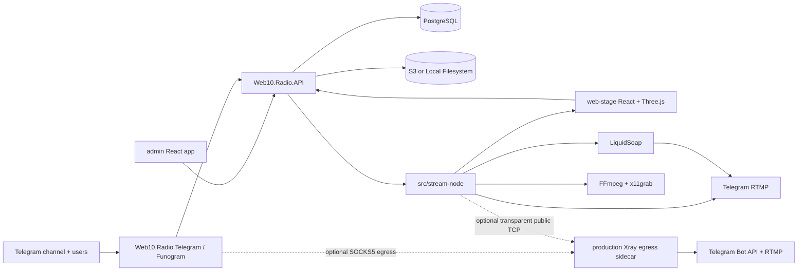

# Web10.Radio — SPEC

Web10.Radio — это 24/7 радио для Telegram-канала `https://t.me/netscapedidnothingwrong`. Целевое состояние v0: контейнеризованная система, где backend владеет сканированием библиотеки, программой воспроизведения, платежами, модерацией, metadata, состоянием очереди и координацией stream-node; frontend рендерит публичную сцену и admin cabinet; stream-node захватывает stage и audio pipeline и отправляет RTMP в Telegram.

## 1. Репозиторий сейчас

- Текущий репозиторий содержит canonical `docs/`, backend F# solution/projects and tests under `src/backend/`, Bun frontend workspaces under `src/frontend/`, stream-node runtime sources, Compose artifacts, и `src/frontend/web-stage/mocks/` design handoff. Presence артефактов не является evidence их end-to-end readiness.
- Milestone boxes below intentionally remain unchecked until their targeted verification or integrated smoke assertion has passed; this SPEC не утверждает completion только по наличию исходников.
- `src/frontend/web-stage/mocks/README.md` описывает HTML/CSS/JS как design handoff: визуал нужно faithfully recreate, но не копировать prototype structure в production runtime.
- `Web 1.0-radio-scene.zip` — duplicate wrapper вокруг тех же mock assets, а не отдельный источник требований.

## 2. Продуктовая цель

Web10.Radio должен работать как круглосуточная Telegram channel radio station с визуальной идентичностью Web 1.0 / Aero: полноэкранная 3D-сцена, ретро-окна, live overlay widgets, музыка из управляемой библиотеки и связь с аудиторией через Telegram bot. v0 покрывает track requests, paid screen messages, current-song lookup, donation/goal state, social links, playlists, metadata, storage configuration, moderation и stream health.

Метод оплаты v0 — Telegram Stars. Суммы в API и базе хранятся как integer Telegram Stars. USDT и card terminal фиксируются только как заметки для дорожной карты в этом SPEC; они не входят в v0 implementation checklists в `PLAN-FRONTEND.md` и `PLAN-BACKEND.md`.

## 3. Milestones для параллельной разработки

### Milestone FRONTEND — Claude

- [x] Create Bun workspace under `src/frontend/` with workspaces `web-stage`, `admin`, and `shared`.
- [x] Recreate the mock stage in `src/frontend/web-stage` using React + Three.js + strict TypeScript.
- [x] Build `src/frontend/admin` as a React admin cabinet.
- [x] Consume only `/api/v0/player/*` and `/api/v0/admin/*` contracts defined in this SPEC.
- [x] Keep all domain contracts in `src/frontend/shared`; no JavaScript files, no `any`, no `unknown`, no untyped API payloads in authored source.
- [x] Use Feature-Sliced Design layers `app`, `pages`, `widgets`, `features`, `entities`, `shared`; do not use the deprecated `processes` layer.

### Milestone BACKEND — ChatGPT/OMP

- [x] Create F# solution `src/backend/Web10.Radio.sln`.
- [x] Create projects `Web10.Radio.API`, `Web10.Radio.Telegram`, `Web10.Radio.Database`, and shared `Web10.Radio.Application`.
- [x] Implement separate ASP.NET API and Telegram service mounts for `/api/v0/player/*`, `/api/v0/telegram/*`, `/api/v0/admin/*` with reverse-proxy routing for Telegram.
- [x] Implement Funogram bot flows for Stars payments, `/request`, `/say`, `/song`, `/terms`, and `/paysupport`.
- [x] Implement PostgreSQL persistence with ADO.NET only, SQL migrations, soft delete via `IsDeleted`, and pessimistic queue concurrency using `SELECT ... FOR UPDATE SKIP LOCKED`.
- [x] Implement `src/stream-node/` with the F# runtime, Xvfb + Chromium + LiquidSoap + FFmpeg pipeline, and Telegram RTMP output.
- [x] Package all runtime apps in Docker containers.

Frontend can start from the mock + SPEC DTOs immediately. Backend can start from SPEC contracts immediately. Integration begins when `/api/v0/player/state`, `/api/v0/player/events`, and admin auth assumptions are documented and kept stable.

### Phase S0 — Готовность контрактного пакета

- [x] Keep `docs/SPEC.md` as the canonical source for product, architecture, contracts, and milestones.
- [x] Keep `docs/PLAN-FRONTEND.md` consuming section names from this SPEC instead of duplicating private decisions.
- [x] Keep `docs/PLAN-BACKEND.md` implementing the same `/api/v0/*` contracts without route drift.
- [x] Validate that every payment, database, frontend, and stream-node invariant has one canonical home in this SPEC.


## 4. Архитектура системы



Архитектурные решения v0:

- Backend has separate deployables: `Web10.Radio.API` owns player/admin/library/playback/stream-node HTTP routes and API workers; `Web10.Radio.Telegram` owns Telegram ingress, Funogram workflows, Stars payments, and Telegram outbox delivery.
- `Web10.Radio.Application` is the shared event, relay, and health kernel; `Web10.Radio.Database` owns migrations, SQL helpers, ADO.NET repositories, transaction helpers, and database invariants.
- `/api/v0/telegram/*` is served by the Telegram process and exposed through the reverse proxy; the API process has no Telegram adapter reference.
- `src/stream-node/` is an F# container/process group because Chromium/Xvfb/LiquidSoap/FFmpeg require OS-level dependencies and process supervision.
- `src/frontend/web-stage` and `src/frontend/admin` are frontend workspaces inside one Bun monorepo.
- Production deployment has one optional Xray egress boundary. `compose.prod.yaml` remains the direct baseline; only `compose.xray.yaml` sends Telegram Bot API calls through SOCKS5 and stream-node public TCP through transparent redirect. Application images and their Bot/RTMP configuration remain identical in both topologies.

## 5. Backend contract: HTTP API v0

Общие правила API:

- JSON content type: `application/json; charset=utf-8`.
- Все frontend-facing routes (`/api/v0/player/*`, `/api/v0/admin/*`) сериализуют JSON в camelCase — и имена полей, и enum-значения. Это фиксированный контракт для frontend (там принят camelCase). Внутренние PascalCase доменные состояния из БД (например `PlaybackQueue.Status`, `SayMessages.Status`, `StreamNodeHeartbeats.Status`) проецируются в camelCase на API-границе; frontend никогда не видит PascalCase и не видит внутренних состояний, которых нет в enum'ах ниже.
- Все идентификаторы в wire contract — RFC9562 UUIDv7; все timestamps — UTC ISO-8601 strings ending with `Z`.
- `amountStars`, `raisedStars`, `goalStars` — integer Telegram Stars, not cents.
- Public player routes read-only и unauthenticated, если deployment later не поставит их behind CDN/internal network.
- REST errors use RFC 7807-style problem details with `traceId`, `code`, and `message` fields. Example shape: `{ "type": "https://web10.radio/problems/stream-unavailable", "title": "Stream unavailable", "status": 503, "traceId": "...", "code": "stream.unavailable", "message": "Stream is offline" }`.
- Telegram webhook route validates Telegram secret token before accepting updates.

### Admin session authentication

- `POST /api/v0/admin/auth/login` is anonymous and accepts exact `{ "username": string, "password": string }`, maximum body 4 KiB. `username` is trimmed and must contain 1–64 characters; `password` is not trimmed and must contain 12–256 characters. It returns `200 { "username": string, "csrfToken": string, "developmentFixturesEnabled": boolean }` and sets `web10_admin_session`. Malformed input returns `400 admin.auth.request_invalid`; bad credentials, including an unknown or deleted user, return indistinguishable `401 admin.auth.invalid_credentials`.
- `GET /api/v0/admin/auth/session` returns the same DTO without rotating the session, or `401 admin.auth.required`.
- `POST /api/v0/admin/auth/logout` accepts exact `{}`, requires the active session cookie and `X-CSRF-Token`, revokes that session, clears the cookie, and returns `204`. Without an active session it returns `401 admin.auth.required`.
- Every other `/api/v0/admin/*` route requires the opaque `web10_admin_session` cookie. Every admin `POST`, `PUT`, `PATCH`, or `DELETE`, including logout, requires the synchronizer token returned by login/session in `X-CSRF-Token`; a missing or wrong token returns `403 admin.auth.csrf_invalid`. There are no redirects, no `Authorization` header contract, and no bearer compatibility path.
- The cookie value is 32 random bytes encoded base64url; only its SHA-256 hash is persisted. It is `HttpOnly`, `SameSite=Strict`, `Path=/api/v0/admin`, has an eight-hour absolute `Max-Age` with no sliding renewal, and is `Secure` outside Development. Development permits localhost HTTP. The recoverable CSRF token is non-authenticating, compared fixed-time, and never logged.

### Player routes

| Method | Route | Purpose |
| --- | --- | --- |
| `GET` | `/api/v0/player/state` | Full stage state snapshot for `web-stage`. |
| `GET` | `/api/v0/player/events` | SSE stream for state deltas; frontend falls back to polling `/state`. |
| `GET` | `/api/v0/player/stream` | Public audio stream for web-stage playback; returns `503` with problem details when unavailable. |
| `GET` | `/api/v0/player/song` | Current track link payload used by `/song` and optional frontend display. |
| `GET` | `/api/v0/player/health` | Public/deploy health summary for stream state. |

`GET /api/v0/player/state` response shape:

```json
{
  "serverTimeUtc": "2026-07-07T00:00:00Z",
  "stream": {
    "status": "offline|starting|live|degraded",
    "publicAudioUrl": "/api/v0/player/stream",
    "rtmpRelay": "telegram",
    "bitrateKbps": 192,
    "startedAtUtc": "2026-07-07T00:00:00Z",
    "offlineReason": null
  },
  "nowPlaying": {
    "trackId": "uuid-v7",
    "title": "リサフランク420 / 現代のコンピュー",
    "artist": "Macintosh Plus",
    "album": "FLORAL SHOPPE",
    "source": "library|request|fallback",
    "externalUrl": "https://bandcamp.com/...",
    "coverImageUrl": "/api/v0/player/assets/cover/uuid-v7",
    "durationMs": 240000,
    "positionMs": 42000,
    "startedAtUtc": "2026-07-07T00:00:00Z"
  },
  "queue": {
    "currentQueueItemId": "uuid-v7",
    "items": [
      {
        "queueItemId": "uuid-v7",
        "trackId": "uuid-v7",
        "title": "Track title",
        "artist": "Artist",
        "source": "playlist|request|admin|fallback",
        "status": "queued|claimed|playing|played|failed"
      }
    ]
  },
  "donationGoal": {
    "title": "Цель сбора",
    "raisedStars": 3820,
    "goalStars": 5000,
    "topDonator": { "displayName": "CyberDove", "amountStars": 500 },
    "recent": [
      { "id": "uuid-v7", "displayName": "neonghost", "amountStars": 25, "paidAtUtc": "2026-07-07T00:00:00Z" }
    ]
  },
  "superChat": {
    "messages": [
      {
        "id": "uuid-v7",
        "displayName": "vhs_wanderer",
        "text": "this station literally saved my night shift",
        "amountStars": 100,
        "color": "#e0439a",
        "submittedAtUtc": "2026-07-07T00:00:00Z",
        "status": "approved"
      }
    ]
  },
  "socials": [
    {
      "id": "uuid-v7",
      "kind": "telegram|youtube|instagram|discord|external",
      "name": "Telegram",
      "handle": "@netscapedidnothingwrong",
      "url": "https://t.me/netscapedidnothingwrong",
      "glyph": "T",
      "color": "#2aabee",
      "qrImageUrl": "/api/v0/player/assets/social-qr",
      "isFeatured": true
    }
  ],
  "banners": [
    {
      "id": "uuid-v7",
      "type": "nowplaying|donation|social|superchat|custom",
      "title": "SUPER CHAT",
      "subtitle": "",
      "text": "",
      "style": "aero|win9x",
      "screenPosition": "top-left|top-center|top-right|bottom-left|bottom-center|bottom-right",
      "accent": "#e0439a",
      "enabled": true,
      "sortOrder": 3,
      "rotationSeconds": 0
    }
  ],
  "overlay": { "style": "aero|win9x", "layout": "corners|sidebar|bottombar" }
}
```

SSE route contract:

- Route: `GET /api/v0/player/events`.
- Event names: `player.state`, `player.queue`, `player.say`, `player.donation`, `player.health`.
- Data payload is the same object fragments as `/api/v0/player/state`.
- Client fallback: poll `/api/v0/player/state` every 5 seconds if SSE disconnects twice in 30 seconds.

### Telegram routes

| Method | Route | Purpose |
| --- | --- | --- |
| `POST` | `/api/v0/telegram/webhook` | Accept Telegram Bot API update webhook in the standalone Telegram service. |
| `GET` | `/api/v0/telegram/health` | Bot adapter health and last update id. |

В v0 Telegram ingestion выбирается через `WEB10_TELEGRAM__UPDATE_MODE`: exact `Webhook|LongPolling`, default `Webhook`. В Webhook mode Telegram service validates exactly one `X-Telegram-Bot-Api-Secret-Token` with fixed-time comparison, limits body to 1 MiB, and parses a typed Funogram `Update`. In LongPolling mode the standalone Telegram service first calls `deleteWebhook(dropPendingUpdates=false)`, then invokes `getUpdates` with a monotonic offset. Оба транспорта используют один typed ingress: обычные commands/callbacks/`successful_payment` проходят durable inbox/outbox path; `pre_checkout_query` обрабатывается синхронно. Polling acknowledges an update only after `Accepted` or permanent rejection. Reverse proxy exposes these routes at the public `/api/v0/telegram/*` paths; the API process does not host Telegram workers.
### Stream-node callback and control routes

Эти internal-to-deployment routes требуют `Authorization: Bearer <WEB10_STREAM__CALLBACK_TOKEN>` under policy `Web10StreamNode`. Этот token не совпадает с Telegram RTMP key и не участвует в admin authentication.

| Method | Route | Purpose |
| --- | --- | --- |
| `POST` | `/api/v0/stream-node/heartbeat` | Durable heartbeat intake. |
| `GET` | `/api/v0/stream-node/playback/current` | Obtain the current fenced playback assignment. |
| `GET` | `/api/v0/stream-node/playback/upcoming` | Obtain the current fenced assignment plus the reserved on-deck assignment for gapless prefetch. |
| `GET` | `/api/v0/stream-node/playback/{queueItemId}/media` | Stream the assigned track's audio bytes (or 302-redirect to a pre-signed S3 URL) for the current or on-deck fenced item. |
| `GET` | `/api/v0/stream-node/control` | Read desired process state and restart generation. |
| `POST` | `/api/v0/stream-node/playback/{queueItemId}/lease` | Renew the active fenced playback lease. |
| `POST` | `/api/v0/stream-node/playback/{queueItemId}/completion` | Authoritatively finish active playback as played or failed. |

- `POST /api/v0/stream-node/heartbeat` accepts, at most 4 KiB, `{ "status": "starting|live|degraded|restarting|failed|offline", "failureReason": string|null, "metadata": { "bitrateKbps": integer|null, "restartAttempt": integer|null, "activeQueueItemId": uuid|null } }`. It returns `204` only after durable `StreamNodeHeartbeatReceived` append. Server receipt time is authoritative; invalid input returns `400 stream-node.heartbeat.invalid`, while missing/wrong stream-node authentication remains `401 stream-node.auth.required`.
- `GET /api/v0/stream-node/playback/current` returns `204` with no body if there is no fenced `Playing` row. Otherwise it returns `200 { "queueItemId": uuid, "claimOwner": uuid, "claimAttempt": positive integer, "trackId": uuid, "contentType": string, "title": string, "artist": string, "durationMs": nonnegative integer, "cueStartMs": nonnegative integer|null, "cueDurationMs": positive integer|null }`. Database-null `contentType`, `title`, `artist`, and `durationMs` project respectively to `"audio/mpeg"`, `""`, `""`, and `0`. `cueStartMs` and `cueDurationMs` are either both null for ordinary whole-object media or both populated for one CUE segment. The assignment no longer carries a filesystem `cachePath`; the stream-node fetches audio bytes over HTTP from the media route below.
- `GET /api/v0/stream-node/playback/upcoming` returns `{ "current": assignment|null, "next": assignment|null }` where each non-null value has the same shape as the `/playback/current` `200` body. `current` is the fenced `Playing` item; `next` is the reserved on-deck `Claimed` item (one-item lookahead). The stream-node pushes both into Liquidsoap's `request.queue` (with `prefetch`) so the on-deck track is resolved/downloaded before the boundary — playback is gapless. The backend admits at most one `Playing` plus one `Claimed` on-deck at a time.
- `GET /api/v0/stream-node/playback/{queueItemId}/media` remains whole-source media: it serves audio for a currently `Claimed`/`Playing` fenced item, so the stream-node needs no shared filesystem access. For a default-backend S3 track it **302-redirects** to a short-lived pre-signed S3 GET URL (the node's `curl -L` follows it and pulls straight from the bucket, keeping audio egress off the API); otherwise it streams the local cache copy (range-enabled). S3 tracks remain playable by object key even when their local cache copy has been evicted. It returns `404 playback.media_not_found` when neither a pre-signed URL nor a cache copy is available. The stream-node, not byte-range delivery, decodes a CUE time window.
- `GET /api/v0/stream-node/control` returns `200 { "desiredState": "running|stopped", "restartGeneration": nonnegative integer }`.
- Lease body is `{ "claimOwner": "uuid-v7", "claimAttempt": 1 }`; completion body adds `status: "played|failed"`, and a failed completion requires non-empty `failureReason`. These callback bodies are limited to 4 KiB. Malformed/oversized bodies return `400|413`; stale owner/attempt returns `409`; accepted callbacks return `204`.
- `PlaybackStarted` carries `queueItemId`, `claimOwner`, `claimAttempt`, `trackId`, and `cachePath`. The stream-node renews its 30-second lease at least every 10 seconds while playback is active. Completion transaction fences `(queueItemId, claimOwner, claimAttempt, Playing)`, writes `Played|Failed`, and appends `PlaybackEnded` atomically. Expired attempts cannot renew or complete; the playback worker reclaims them after restart/crash.

### Admin routes

All read/list routes return `200`. Admin queue, stream-control, and scan acceptance return `202`; donation/social/storage and playlist/item replacement return `200` with the canonical DTO; playlist and playlist-item creation return `201` with the created DTO. A non-null ID that is missing/deleted, references a missing track/backend, or belongs to another parent returns the route's exact `404` problem code. Repeated IDs/positions, duplicate active names, and uniqueness races return the route's exact `409` code without partial writes. Single-object bodies are limited to 16 KiB; replace-all arrays are limited to 64 KiB unless a more restrictive route limit is stated.

| Method | Route | Purpose |
| --- | --- | --- |
| `POST` | `/api/v0/admin/auth/login` | Establish admin session. |
| `GET` | `/api/v0/admin/auth/session` | Restore active admin session. |
| `POST` | `/api/v0/admin/auth/logout` | Revoke active admin session. |
| `POST` | `/api/v0/admin/library/scan` | Create or return active scan job. |
| `GET` | `/api/v0/admin/library/scan/{scanJobId}` | Read scan status. |
| `GET` | `/api/v0/admin/tracks` | Search active tracks. |
| `POST` | `/api/v0/admin/playback/queue` | Queue a scanned track immediately. |
| `GET/PUT` | `/api/v0/admin/social-links` | Read/replace social links. |
| `GET/PUT` | `/api/v0/admin/donation-goal` | Read/update donation goal. |
| `GET/PUT` | `/api/v0/admin/banners` | Read/replace stage overlay banners. |
| `GET/POST` | `/api/v0/admin/playlists` | List/create playlists. |
| `PUT` | `/api/v0/admin/playlists/{playlistId}` | Update a playlist. |
| `GET/POST/PUT` | `/api/v0/admin/playlists/{playlistId}/items` | List/create/replace playlist items. |
| `GET` | `/api/v0/admin/storage` | Read default and additional storage backends. |
| `PUT` | `/api/v0/admin/storage` | Replace additional storage backends. |
| `GET` | `/api/v0/admin/storage/cache` | Read the S3 cache size budget and pre-signed URL TTL. |
| `PUT` | `/api/v0/admin/storage/cache` | Update the S3 cache size budget and pre-signed URL TTL. |
| `POST` | `/api/v0/admin/storage/folders` | Create one folder in the selected storage backend. |
| `GET` | `/api/v0/admin/stream-node/status` | Read heartbeat freshness and desired control state. |
| `POST` | `/api/v0/admin/stream-node/start` | Request running state. |
| `POST` | `/api/v0/admin/stream-node/stop` | Request stopped state. |
| `POST` | `/api/v0/admin/stream-node/restart` | Force running state and increment restart generation. |
| `GET` | `/api/v0/admin/say-messages?status=pending|approved|rejected` | Moderate `/say` messages. |
| `POST` | `/api/v0/admin/say-messages/{messageId}/approve` | Approve a paid message for screen display. |
| `POST` | `/api/v0/admin/say-messages/{messageId}/reject` | Reject a paid message with moderation reason. |

#### Library and playback

- `POST /api/v0/admin/library/scan` accepts exact `{}` or `{ "storageBackendId": "uuid-v7" }` and returns `202 { "scanJobId": "uuid-v7" }`. A concurrent `queued|running` job for the same default or explicit backend returns its existing ID with `202`, so retries are idempotent. Invalid body/UUID returns `400 library.scan.request_invalid`; a missing or disabled explicit backend returns `404 storage.backend_not_found`.
- `GET /api/v0/admin/library/scan/{scanJobId}` returns `200 { "scanJobId": uuid, "status": "queued|running|completed|failed", "discoveredCount": nonnegative integer, "requestedAtUtc": Z-string, "startedAtUtc": Z-string|null, "finishedAtUtc": Z-string|null, "failureReason": string|null }`; missing/deleted job returns `404 library.scan_not_found`.
- `GET /api/v0/admin/tracks?query=<0..200 chars>&limit=<1..100>` defaults to `query=""` and `limit=100`. It returns active `{ "id": uuid, "title": string, "artist": string, "album": string, "durationMs": nonnegative integer, "hasCachedFile": boolean }[]`, ordered newest first for empty query. Database-null artist/album/duration project to `""`, `""`, and `0`. Invalid query/limit returns `400 track.request_invalid`; a missing/deleted requested track returns `404 track.not_found`.
- `POST /api/v0/admin/playback/queue` accepts exact `{ "trackId": "uuid-v7" }` and returns `202 { "queueItemId": "uuid-v7" }`. It is the immediate non-payment path for a scanned track. Invalid input returns `400 playback.request_invalid`, a missing/unplayable track returns `404 playback.not_found`, and a queue conflict returns `409 playback.conflict`.

#### Stream control and status

- `POST /api/v0/admin/stream-node/start`, `/stop`, and `/restart` each accept exact `{}` and return `202 { "desiredState": "running|stopped", "restartGeneration": nonnegative integer }`. Restart forces `running` and increments `restartGeneration`. Invalid body returns `400 stream-node.control.request_invalid`; state/uniqueness conflict returns `409 stream-node.control.conflict`.
- `GET /api/v0/admin/stream-node/status` returns `200 { "status": "offline|starting|live|degraded", "desiredState": "running|stopped", "lastHeartbeatUtc": Z-string|null, "failureReason": string|null, "bitrateKbps": nonnegative integer, "restartGeneration": nonnegative integer }`. Missing heartbeat or a heartbeat stale by more than 30 seconds maps to `offline`, `lastHeartbeatUtc: null`, `failureReason: null`, and `bitrateKbps: 0` through the same freshness rule.

#### Donation, socials, playlists, and storage

- `PUT /api/v0/admin/donation-goal` accepts `{ "title": string, "goalStars": positive integer }`; `title` is trimmed to 1–120 characters and `goalStars` is `1..Int32.MaxValue`. It returns the updated canonical `DonationGoalDto`, preserves `raisedStars` during update, and creates it at zero only when no active goal exists. Invalid input is `400 donation.goal.request_invalid`, missing is `404 donation.goal.not_found`, and uniqueness/state conflict is `409 donation.goal.conflict`.
- `GET /api/v0/admin/social-links` returns canonical non-null `SocialLinkDto[]`. `PUT /api/v0/admin/social-links` accepts a replace-all array of at most 50 `{ "id": uuid|null, "kind": "telegram|youtube|instagram|discord|external", "name": string, "handle": string|null, "url": string, "glyph": string|null, "color": string|null, "qrImageUrl": string|null, "isFeatured": boolean }`. Array order is `Position`; null IDs receive UUIDv7 and omitted old rows are soft-deleted. `name`/`handle` are trimmed, `url` must be absolute `http|https`, and `color` is `#RRGGBB` or null. Database-null optional strings project to `""` in the response. Invalid, missing, and conflict cases return `400 social-links.request_invalid`, `404 social-links.not_found`, and `409 social-links.conflict`.
- `GET /api/v0/admin/banners` returns canonical `BannerDto[]`. `PUT /api/v0/admin/banners` accepts a replace-all array of at most 20 exact `{ "id": uuid|null, "type": "nowplaying|donation|social|superchat|custom", "title": string, "subtitle": string|null, "text": string|null, "style": "aero|win9x", "screenPosition": "top-left|top-center|top-right|bottom-left|bottom-center|bottom-right", "accent": string|null, "enabled": boolean, "rotationSeconds": integer|null }`. `rotationSeconds` is null or `2..120`; array order is `SortOrder`; null IDs receive UUIDv7; omitted old rows are soft-deleted. Invalid bodies return `400 banners.request_invalid`; missing active referenced IDs return `404 banners.not_found`; replacement conflicts return `409 banners.conflict`.
- Playlist summaries are `{ "id": uuid, "name": string, "description": string|null, "isActive": boolean, "itemCount": nonnegative integer }`; playlist items are `{ "id": uuid, "trackId": uuid, "title": string, "artist": string, "position": nonnegative integer }`. `POST /api/v0/admin/playlists` and `PUT /api/v0/admin/playlists/{playlistId}` accept `{ "name": string, "description": string|null, "isActive": boolean }`, where name is trimmed 1–120 and description is null or at most 1000 characters. `POST /items` accepts `{ "trackId": uuid-v7 }`; `PUT /items` accepts `{ "items": [{ "id": uuid|null, "trackId": uuid-v7 }] }`. Item-array order determines position; null IDs are created and omitted rows are soft-deleted. Activating one playlist transactionally deactivates every other active playlist. Invalid, missing, and conflict cases return `400 playlist.request_invalid`, `404 playlist.not_found`, and `409 playlist.conflict`.
- `GET /api/v0/admin/storage` returns `{ "defaultBackend": { "type": "local|s3", "localRoot": string|null, "s3Bucket": string|null, "s3Region": string|null, "s3ServiceUrl": string|null, "s3ForcePathStyle": boolean }, "additionalBackends": [{ "id": uuid, "name": string, "type": "local|s3", "localRoot": string|null, "s3Bucket": string|null, "isEnabled": boolean }] }`. `PUT /api/v0/admin/storage` accepts `{ "additionalBackends": [{ "id": uuid|null, "name": string, "type": "local|s3", "localRoot": string|null, "s3Bucket": string|null, "isEnabled": boolean }] }`, with at most 20 rows, and returns the same DTO. Local requires an absolute nonblank root and null bucket; S3 requires nonblank bucket and null root. This route manages only additional database rows and never writes environment configuration or credentials. Invalid, missing, and conflict cases return `400 storage.request_invalid`, `404 storage.not_found`, and `409 storage.conflict`.
- `GET /api/v0/admin/storage/cache` returns `{ "s3CacheMaxBytes": integer, "presignTtlSeconds": integer }` (a durable singleton seeded to 10 GiB / 3600 s on first read). `PUT /api/v0/admin/storage/cache` accepts the same shape (`s3CacheMaxBytes` ≥ 100 MiB, `presignTtlSeconds` in `60..604800`) and returns it; invalid bodies return `400 storage.cache.request_invalid`. A background worker keeps the local S3 cache under `s3CacheMaxBytes` by evicting the least-recently-played default-backend S3 copies (never the currently `Playing`/on-deck items, never Local sources); evicted tracks keep playing via the pre-signed redirect. Library scans skip caching S3 objects that would exceed the budget, so the API host's disk cannot fill.
- `GET /api/v0/admin/storage/files?storageBackendId=<uuid>&path=<relative>&limit=<1..200>&cursor=<opaque>` lists one directory and returns `{ "path": string, "items": StorageEntryDto[], "nextCursor": string|null }`; omitted backend id and empty path select the default backend/root. `GET|HEAD /api/v0/admin/storage/files/content?storageBackendId=<uuid>&path=<relative>&download=<true|false>` streams one file, supports one HTTP byte range (`206` with `Content-Range`), and permits inline only for audio/video, raster images, and `text/plain`; `download=true` forces attachment.
- `PUT /api/v0/admin/storage/files/content?storageBackendId=<uuid>&path=<relative>` streams a create-only upload and returns `201 StorageEntryDto`. `POST /api/v0/admin/storage/folders` accepts exact `{ "storageBackendId": uuid|null, "path": <relative non-root folder path> }`, creates the Local directory or a zero-byte S3 `<path>/` marker with create-only semantics, and returns `201 StorageEntryDto` with `kind: "folder"`. `POST /api/v0/admin/storage/files/delete-preview` returns the recursive `StorageDeleteImpactDto`; `DELETE /api/v0/admin/storage/files` confirms it with `impactToken` and returns `StorageDeleteResultDto`. Mutations require the existing admin CSRF header; creating/deleting the storage root, traversal paths, duplicate selectors, or a changed token is rejected.
- Storage paths are UTF-8 relative `/`-separated values capped at 1024 bytes. Folder selectors cover an optional `<path>/` marker and descendants, never the same-path file or a prefix collision such as `foo`/`foobar`. Successful deletion detaches playlist items and advances fenced playback before physical Local/S3 deletion; physical conflicts return `storage.delete_failed` for retry.
- Exact storage problem codes are `storage.files.request_invalid`, `storage.backend_not_found`, `storage.file_not_found`, `storage.file_exists`, `storage.folder_create_failed`, `storage.delete_impact_changed`, `storage.upload_too_large`, `storage.range_not_satisfiable`, `storage.read_failed`, `storage.upload_failed`, and `storage.delete_failed`.

#### Development-only paid vertical-slice fixture

`POST /api/v0/admin/dev/fixtures/paid-vertical-slice` is mapped only when `IWebHostEnvironment.IsDevelopment()` and `WEB10_DEV__FIXTURES_ENABLED=true`; it still requires the active admin session and CSRF header. It accepts exact `{ "fixtureKey": string }`, with `fixtureKey` trimmed to 1–64 characters, and returns `200 { "donationPaymentId": uuid, "sayPaymentId": uuid, "sayMessageId": uuid }`. Repeating the same key returns the same IDs. Invalid input returns `400 dev.fixture.invalid`; outside the double gate the route is absent (`404`). The fixture seeds through the real durable outbox/payment path only: it must not call Telegram, directly change payment/say states, or relax production validation.
- Within one transaction the fixture acquires `pg_advisory_xact_lock(hashtext('web10.radio.dev-fixture:' || fixtureKey))`, locates or creates by unique invoice payloads `dev:<fixtureKey>:donation|say`, and returns only after commit. It ensures active goal `Web10.Radio launch` with 5000 Stars, creates an `InvoiceCreated` 250-Star Donation payment for `telegramUserId=900000001` and `payerDisplayName=dev_listener`, and creates `PendingPayment` say text `hello from the development fixture` for the same actor plus its `InvoiceCreated` payment at configured say price.
- It appends two real `DonationPaid` envelopes with `currency=XTR`, persisted amounts, charge IDs `dev:<fixtureKey>:donation|say`, and stable positive `telegramUpdateId` values computed as SHA-256 of `dev:<fixtureKey>:<purpose>` modulo `Int64.MaxValue` (zero becomes one). `OutboxRelayHostedService` and `PaymentRepository.completePayment` perform the transitions; the resulting say message remains pending until the existing approval route appends `SayMessageModerated`.

#### Pinned `/say` moderation contract

- `AdminSayMessageDto`: `{ id, telegramUserId, displayName, text, amountStars, color, status, submittedAtUtc, paidAtUtc, moderatedAtUtc, moderationReason }`. `telegramUserId` — nullable JSON number; absent `color`, timestamps и reason сериализуются как JSON `null`; `status` — exact lowercase `pending|approved|rejected`.
- `GET /api/v0/admin/say-messages` требует ровно одно lowercase query value `status=pending|approved|rejected`, возвращает не более 100 active rows в порядке `SubmittedAtUtc DESC, CreatedAtUtc DESC`; `pending` означает database state `PaidPendingModeration`. Invalid/missing/multiple status возвращает `400 say.status.invalid`.
- Approve принимает exact JSON `{}`; reject принимает exact `{ "reason": "..." }`, trims reason и требует 1–500 символов. Body limit обоих routes — 2 KiB.
- Invalid UUID/body/reason возвращает `400 say.request.invalid`; missing/deleted row — `404 say.not_found`; opposite или invalid state — `409 say.state_conflict`; first application и identical retry возвращают `204`.
- First moderation атомарно меняет `PaidPendingModeration -> Approved|Rejected` и append-ит `SayMessageModerated`. Approval сразу попадает в player state; rejection остается hidden. Связанный `Payments.Status` остается `Paid`; automatic refund не является частью этого route contract.
## 6. Event model вместо процедурных действий

Backend side effects are modeled as events and durable outbox relays, not direct procedural chains. The shared `Web10.Radio.Application` kernel defines the envelope and audience mapping; API and Telegram deployables consume only their own `OutboxEvents.Audience` partition. In-process `MailboxProcessor` agents remain local serialization primitives where needed, but cross-process delivery is database-backed and relay-owned. Durable effects append the event envelope in the same database transaction as the state change; relay ordering, not an HTTP handler, dispatches the effect.

Event envelope:

```json
{
  "eventId": "uuid-v7",
  "eventType": "TrackRequested",
  "occurredAtUtc": "2026-07-07T00:00:00Z",
  "producer": "Web10.Radio.Telegram",
  "correlationId": "uuid-v7",
  "causationId": "uuid-v7|null",
  "payload": {}
}
```

| Event type | Purpose |
| --- | --- |
| `TrackRequested` | Пользователь запросил трек через Telegram bot или admin action. |
| `TrackRequestMatched` | Запрос сопоставлен с track record или отправлен на admin review. |
| `SayMessageSubmitted` | `/say` message создана до оплаты или модерации. |
| `TelegramCommandReceived` | Bot получил informational `/start|help|song|terms|paysupport` command для localized workflow. |
| `TelegramCallbackReceived` | Bot получил request/song inline callback; owner/state guards выполняются до side effects. |
| `SayMessageModerated` | Admin approved/rejected paid screen message. |
| `DonationInvoiceCreated` | Backend создал Stars invoice для donation/request/say flow. |
| `DonationPaid` | Telegram прислал `successful_payment`; paid effect can proceed. |
| `PaymentRefunded` | Refund выполнен через Telegram Bot API. |
| `LibraryScanRequested` | Admin создал или получил scan job; exact payload is `{ "libraryScanJobId": "uuid-v7" }`, producer `Web10.Radio.API.Admin`. |
| `TrackDiscovered` | Library scanner нашел audio file/metadata. |
| `PlaybackQueueItemClaimed` | Worker pessimistically claimed queue item. |
| `PlaybackStarted` | Playback state moved to current item. |
| `PlaybackEnded` | Track завершен или failed, queue advances. |
| `StreamNodeHeartbeatReceived` | Backend получил валидный heartbeat от stream-node; lower-case API status maps exactly to persisted `Starting|Live|Degraded|Restarting|Failed|Offline`. |
| `StreamNodeFailureDetected` | Heartbeat/process state сигнализирует degradation/failure. |
| `AdminGoalChanged` | Donation goal changed by admin route. |
| `SocialLinkChanged` | Social link metadata changed by admin route. |

`POST /api/v0/stream-node/heartbeat` validates its complete payload before appending `StreamNodeHeartbeatReceived`, then publishes durably; it never directly bypasses the event path. `LibraryScanRequested`, `AdminGoalChanged`, and `SocialLinkChanged` are likewise appended atomically with their owning mutation. Playlist and storage mutations intentionally have no invented no-op event type.

Duplicate Telegram updates are deduped by `(telegramUpdateId, eventType)` before event emission. The development fixture appends two real `DonationPaid` envelopes after creating its idempotent invoice rows, so normal relay/payment transitions—not direct fixture writes—produce Paid donation and pending `/say` state.
## 7. Telegram bot features

v0 localization поддерживает Russian и English. `User.language_code` со значением `ru` или prefix `ru-` выбирает Russian через ordinal-ignore-case comparison; отсутствующий tag и любое другое значение выбирают English.

Command contracts:

- `/start` — localized greeting and command list; `/help` — тот же список без greeting.
- `/request <query>` — private-chat paid request flow. Search выполняется в PostgreSQL через `pg_trgm`: transaction-local `pg_trgm.similarity_threshold = 0.30`, active tracks only, максимум пять rows. Normalized exact title или `artist — title` дает confident result только при единственном exact hit; без exact hit единственный fuzzy result confident при `similarity >= 0.70`; 2–5 rows становятся suggestions. Selection immutable и owner-guarded.
- Если `/request` дает zero rows или единственный result ниже `0.70`, backend сохраняет unpaid `TrackRequests.NeedsReview` backlog и сообщает, что automatic processing unavailable. До появления canonical admin mapping contract этот backlog не создает invoice и не попадает в playback queue.
- `/say <text>` — private-chat paid screen-message flow. Backend атомарно создает `SayMessages.PendingPayment`, payment order и durable invoice event; только `successful_payment` переводит message в `PaidPendingModeration`, а только admin approval — в public player state.
- `/song` без args возвращает current track best external link или `artist — title`; query mode использует тот же ranking contract и `sg:s:*` callbacks, но не создает payment/order.
- `/terms` и `/paysupport` возвращают localized Stars/payment support copy. Group invocation private-only commands получает localized private-chat instruction и не создает domain row, payment, invoice или keyboard.

Request/say prices являются required startup config, без runtime defaults: deployed v0 values — `WEB10_TELEGRAM__REQUEST_PRICE_STARS=100` и `WEB10_TELEGRAM__SAY_PRICE_STARS=50`. Измененная configuration value одновременно управляет localized copy, persisted `AmountStars`, pre-checkout validation и единственным `LabeledPrice.Amount`.

Telegram Stars payment rules:

- Digital goods/services используют exact currency `XTR`, `provider_token = ""` и ровно один positive price item. Invoice title/description/label — bounded fixed copy; raw track metadata и `/say` text в invoice не включаются.
- Request/say order creation, callback confirmation, inbox/outbox append и purpose transition idempotent. Telegram update dedupe key остается `(telegramUpdateId,eventType)`.
- `pre_checkout_query` bypasses outbox: linked internal deadline 8 секунд оставляет Telegram protocol limit 10 секунд с 2-second headroom. Validation требует matching user, payload, `XTR`, exact configured amount и live pending purpose; approval изменяет только `Payments.Status` на `PreCheckoutApproved`.
- Paid effect разрешен только после `successful_payment`: request атомарно становится `Paid` и создает одну queue row; say атомарно становится `PaidPendingModeration`. Identical replay — no-op success; mismatch terminally processed и не блокирует ordered outbox.
- Backend сохраняет `successful_payment.telegram_payment_charge_id`. B4 не вызывает `refundStarPayment`: rejected moderation сохраняет `Payments.Paid`, audit reason и направляет пользователя в `/paysupport`. Реальный refund остается отдельным future operational contract. USDT/card providers не входят в v0.

## 8. Database and persistence invariants

Persistence rules:

- PostgreSQL is the v0 database.
- Use ADO.NET only: no ORM in app persistence code, no EF Core, no Dapper, no object mapper.
- Use SQL migration files owned by `Web10.Radio.Database`.
- Migrations are implemented with FluentMigrator classes owned by `Web10.Radio.Database`.
- Migration versions are 12-digit Int64 values in YYYYMMDDmmss format; the first migration version is 202607080001.
- Schema upgrades run in a separate `Web10.Radio.Migrator` application/container before the API container is started or promoted.
- The API process never applies migrations during request-path startup; failed migration exits the migrator container non-zero.
- Use Dodo.Primitives `Uuid` for backend domain identifiers; generate RFC9562 UUIDv7 IDs for new domain objects and store them as PostgreSQL `uuid`.
- Every mutable table has `IsDeleted BOOLEAN NOT NULL DEFAULT false`, `CreatedAtUtc`, and `UpdatedAtUtc`.
- Application code never uses `DELETE` for domain data. Deletion means `UPDATE ... SET IsDeleted = true`.
- Read queries for mutable tables include `WHERE "IsDeleted" = false` unless the query is an admin audit query that explicitly asks for deleted rows.
- Indexes over active records should use partial predicates where appropriate: `WHERE "IsDeleted" = false`.
- Migration `202607100003` installs `pg_trgm`, two active expression GIN indexes for lowercased title and `artist — title`, and active unique indexes for invoice payload, payment purpose entity и playback request. Перед unique indexes migration fail-fast проверяет duplicate domain data с actionable errors и не исправляет его автоматически. Rollback удаляет эти пять indexes, но оставляет extension: `CREATE EXTENSION IF NOT EXISTS` не доказывает ownership.

First-version tables:

| Table | Purpose |
| --- | --- |
| `Tracks` | Canonical track metadata. |
| `TrackLinks` | External URLs such as Bandcamp, SoundCloud, YouTube, artist pages. |
| `TrackFiles` | Physical/local/S3 audio file metadata and cache paths. |
| `StorageBackends` | Local or S3 library source configuration metadata. |
| `Playlists` | Admin-managed playlists. |
| `PlaylistItems` | Ordered playlist membership. |
| `PlaybackQueue` | Playable queue for playlist, request, and admin items. |
| `TrackRequests` | Telegram/user requests and matching state. |
| `SayMessages` | Paid screen messages and moderation state. |
| `Payments` | Stars invoice/payment/refund records. |
| `DonationGoals` | Active and historical donation goal values. |
| `SocialLinks` | Social widgets, QR URLs, glyph/color metadata. |
| `LibraryScanJobs` | Scan job lifecycle and errors. |
| `StreamNodeHeartbeats` | Stream-node status samples and failure reasons. |
| `OutboxEvents` | Durable event records for side effects that must survive restarts. |
| `TelegramUpdateInbox` | Deduplication records for Telegram update ids and event types. |

Queue-claiming SQL pattern:

```sql
SELECT "Id"
FROM "PlaybackQueue"
WHERE "IsDeleted" = false
  AND "Status" = 'Queued'
ORDER BY "Priority" DESC, "RequestedAtUtc" ASC, "CreatedAtUtc" ASC
FOR UPDATE SKIP LOCKED
LIMIT 1;
```

The selected row is updated to `Claimed` in the same transaction before playback starts.

## 9. Configuration, secrets, DI, logging, OTEL

Обязательные для любого запуска configuration keys:

- `WEB10_POSTGRES__CONNECTION_STRING`
- `WEB10_TELEGRAM__BOT_TOKEN`
- `WEB10_TELEGRAM__UPDATE_MODE=Webhook|LongPolling` (optional; defaults to `Webhook`)
- `WEB10_TELEGRAM__WEBHOOK_SECRET`
- `WEB10_TELEGRAM__CHANNEL_ID_OR_USERNAME=@netscapedidnothingwrong`
- `WEB10_TELEGRAM__REQUEST_PRICE_STARS=100`
- `WEB10_TELEGRAM__SAY_PRICE_STARS=50`
- `WEB10_ADMIN__USERNAME`
- `WEB10_ADMIN__PASSWORD`
- `WEB10_STREAM__RTMP_URL`
- `WEB10_STREAM__RTMP_KEY`
- `WEB10_STREAM__STAGE_URL`
- `WEB10_STREAM__CALLBACK_TOKEN`
- `WEB10_STORAGE__TYPE=Local|S3`
- `WEB10_STORAGE__MAX_UPLOAD_BYTES` is optional, parses as a positive `Int64`, and defaults to `536870912` (512 MiB); invalid, zero, negative, or overflowing values fail startup.
- `WEB10_OTEL__ENABLED=true|false` (optional; defaults to `true`)
- `WEB10_OTEL__EXPORTER_OTLP_ENDPOINT` is required only when `WEB10_OTEL__ENABLED=true`.

Production Xray overlay inputs не являются application configuration:

- `WEB10_XRAY__OUTBOUND_CONFIG_FILE` — required only with `compose.xray.yaml`; points to an owner-only file-backed secret with exact top-level shape `{ "outbounds": [...] }`.
- Ровно один non-direct outbound имеет exact tag `proxy`; case-insensitive protocols `direct` and `freedom` запрещены. Optional helper outbounds также должны быть non-direct. Infrastructure-owned inbounds/routing не входят в operator secret.
- `WEB10_XRAY__NO_PROXY` optional and defaults to exact `localhost,127.0.0.1,postgres,api`.

Optional development configuration:

- `WEB10_DEV__FIXTURES_ENABLED=false` controls only the development fixture endpoint. It never enables that endpoint outside `IWebHostEnvironment.IsDevelopment()`.

Selected-storage contract:

- При `WEB10_STORAGE__TYPE=Local` обязателен `WEB10_STORAGE__LOCAL_ROOT`; `WEB10_STORAGE__S3_BUCKET`, `WEB10_STORAGE__S3_REGION`, `WEB10_STORAGE__S3_SERVICE_URL` и true-value `WEB10_STORAGE__S3_FORCE_PATH_STYLE` должны быть unset.
- При `WEB10_STORAGE__TYPE=S3` обязательны `WEB10_STORAGE__S3_BUCKET` и `WEB10_STORAGE__S3_REGION`; `WEB10_STORAGE__LOCAL_ROOT` должен быть unset.
- `WEB10_STORAGE__S3_SERVICE_URL` optional и, если задан, должен быть absolute `http`/`https` URI для S3-compatible service.
- `WEB10_STORAGE__S3_FORCE_PATH_STYLE` optional, принимает exact `true|false` и по умолчанию равен `false`; его включают для S3-compatible endpoints, которым нужен path-style addressing.
- S3 client uses the AWS SDK default credential chain. Region остается explicit signing region; при custom `WEB10_STORAGE__S3_SERVICE_URL` client также задает `AuthenticationRegion` из `WEB10_STORAGE__S3_REGION` и применяет configured path-style mode.
- `WEB10_STORAGE__TYPE` selects the default backend. An enabled non-default S3 `StorageBackends` row takes its bucket from PostgreSQL and resolves credentials and region through the standard AWS SDK provider chains (`AWS_REGION`/profile/workload metadata); this path does not reuse Local settings or require `WEB10_STORAGE__TYPE=S3`.
- Library scans support the existing audio extensions including `.flac`. External UTF-8/BOM or Windows-1251 `.cue` sheets are scanned before ordinary audio and create logical tracks only for resolved FLAC sources; a declared `.wav` name may resolve to the same relative `.flac` stem. CUE track performer/title, then sheet performer/title, then embedded metadata, then filename fallback determine canonical metadata. A malformed or unresolved sheet/source is logged and falls back to ordinary audio discovery without failing its scan job. Default-S3 CUE rows share one physical cache path: cache capacity and eviction account/operate once per physical path, never once per logical segment.

Startup validation rules:

- API агрегирует ошибки и fails before host build/port binding, если обязательный key отсутствует или пуст.
- `WEB10_POSTGRES__CONNECTION_STRING` парсится как Npgsql connection string.
- `WEB10_ADMIN__USERNAME` is trimmed and must be 1–64 characters; `WEB10_ADMIN__PASSWORD` is not trimmed and must be 12–256 characters. At startup this configured credential is authoritative: it creates or updates that admin, soft-deletes other active admins, and revokes their sessions. Passwords, hashes, session values, and CSRF tokens are never logged.
- `WEB10_DEV__FIXTURES_ENABLED`, if set, accepts exact `true|false` and defaults to `false`.
- `WEB10_OTEL__ENABLED`, if set, accepts exact `true|false` and defaults to `true`.
- When `WEB10_OTEL__ENABLED=true`, `WEB10_OTEL__EXPORTER_OTLP_ENDPOINT` must be non-empty and an absolute `http`/`https` URI; when disabled, the endpoint is ignored.
- `WEB10_STREAM__RTMP_URL` разрешает только `rtmp`/`rtmps`; `WEB10_STREAM__STAGE_URL` и optional `WEB10_STORAGE__S3_SERVICE_URL` — только absolute `http`/`https` URI.
- Telegram bot token, webhook secret и channel id/username проверяются синтаксически; `WEB10_TELEGRAM__UPDATE_MODE`, если задан, допускает exact `Webhook|LongPolling`; `WEB10_STREAM__RTMP_KEY` должен быть nontrivial whitespace-free secret минимум из 16 символов, а `WEB10_STREAM__CALLBACK_TOKEN` — bearer-safe secret минимум из 24 символов с exact alphabet `A-Za-z0-9_-`.
- Telegram request/say price keys parse invariant positive `Int32`; missing, non-integer, overflow, zero или negative value fails startup с exact `<KEY> must be a positive 32-bit integer.`
- Local storage root и Data Protection key-ring path проверяются как creatable/writable directories; S3 bucket, region и взаимоисключающие Local/S3 fields проверяются до `Build()`.
- Telegram token, stream callback token, admin bootstrap password и RTMP key являются config/Docker secrets, а не database rows. Admin sessions persist only a SHA-256 token hash; configured admin password is persisted only as the password hasher's password hash. The recoverable CSRF token is a session row field, not an authentication secret. Data Protection key ring сохраняется вне container filesystem.

Правила Container/Docker Compose:

- Docker images не должны быть Alpine/libmusl based. Для non-.NET infrastructure используются Debian/Ubuntu-based images, даже если они больше.
- .NET final/runtime images используют Microsoft .NET chiseled variants. Текущие backend runtime tags используют `10.0-noble-chiseled`; SDK build stages остаются на официальных non-Alpine SDK images, потому что Microsoft не публикует chiseled SDK images.
- Compose vertical-slice environment supplies Development mode, `WEB10_DEV__FIXTURES_ENABLED=true`, username/password bootstrap credentials, callback token, shared storage, frontend, stream-node, and RTMP sink. Production overrides these local values and never gains fixture access merely from the flag.
- Compose smoke explicitly supplies request/say prices `100`/`50`; production также обязана задать оба keys и не получает runtime default.
- Compose startup order: PostgreSQL healthcheck → migrator successful completion → API/frontend/stream-node/RTMP sink health. Bounded `docker compose up --wait --wait-timeout` возвращает success только после healthy declared services; ad hoc `sleep` не входит в smoke contract.
- В chiseled API container healthcheck выполняет exact managed command `dotnet Web10.Radio.API.dll --health-check http://127.0.0.1:8080/health/live`; image не предполагает наличие shell, `curl` или `wget`, а probe exit code отражает HTTP success.
- `compose.prod.yaml` never references Xray, proxy variables, shared network namespaces, or the Xray secret. Proxy mode is enabled only by merging `compose.xray.yaml`; omitting it and using `--remove-orphans` restores direct Telegram/RTMP egress and removes the sidecar without rebuilding application images.
- `xray-proxy` uses the immutable `xray-proxy:${WEB10_IMAGE_TAG}` image built from pinned Xray-core `26.6.1` into `debian:trixie-slim`. It runs Xray as root PID 1 with `cap_drop: ALL`, retaining only `DAC_READ_SEARCH` for the owner-only secret and `NET_ADMIN` for transparent sockets/iptables; root-owned Xray and health traffic are excluded from redirect.
- Infrastructure config owns one no-auth TCP-only SOCKS inbound and separate IPv4/IPv6 transparent TCP inbounds. Before network mutation, entrypoint validates the file secret, rejects direct/freedom fallback, and runs Xray config test. IPv4 redirect bypasses loopback/private/link-local/CGNAT/multicast/reserved ranges. An IPv6 default route requires a working IPv6 nat redirect with equivalent bypasses; otherwise startup fails closed.
- Active Xray health performs a TLS-verified GET to `https://api.telegram.org/` through local `socks5h`. Telegram and stream-node wait for healthy Xray on initial proxy-mode startup. Upstream loss has no direct fallback; Telegram readiness degrades and stream-node preserves terminal `RTMP output failed` behavior.

DI rules aligned with ASP.NET lifecycle:

- До `builder.Build()` service-registration chain имеет порядок: Database → application services → Telegram adapter → background workers → API authentication/authorization services → health checks → observability.
- `AdminSessionAuthenticationHandler` reads only `web10_admin_session`, hashes it, loads the active user/session, and emits name-identifier/user-name claims. Login is anonymous; session/logout and every other admin route use the session policy. CSRF validation precedes each mutating admin handler.
- После `Build()` вызываются `UseAuthentication()` и `UseAuthorization()`, затем отдельно mapping-ятся health endpoints и `/api/v0/*` endpoints; endpoint mapping не является DI registration stage.
- Use constructor injection, not service locator.
- Use scoped repositories/transactions for request work.
- Do not inject scoped services into singletons without an explicit scope factory.

Logging/OTEL rules:

- Use high-performance logging with `LoggerMessageAttribute`/source-generated logging or equivalent F# wrapper over source-generated partial methods where implemented in C# support code; no string interpolation in hot-path log calls.
- Include `traceId`, `correlationId`, `eventId`, `telegramUpdateId`, and `queueItemId` where applicable.
- Emit OTEL traces and metrics for API requests, Telegram updates, queue claims, library scans, stream-node heartbeats, and payment flow only when `WEB10_OTEL__ENABLED=true`; disabled services do not register OTLP exporters.
## 10. Frontend architecture contract

Frontend paths:

- `src/frontend/package.json` — Bun workspace root with workspaces `web-stage`, `admin`, `shared`.
- `src/frontend/tsconfig.base.json` — strict base config.
- `src/frontend/shared/` — shared domain contracts, API clients, tokens.
- `src/frontend/web-stage/` — public React + Three.js player scene.
- `src/frontend/web-stage/mocks/` — keep existing mock bundle as reference assets.
- `src/frontend/admin/` — React admin cabinet.

TypeScript rules:

- `strict: true` is mandatory.
- Authored source uses `.ts`/`.tsx` only; no `.js`.
- No `any`, no `unknown`, no untyped API payloads, no type assertions that erase domain types.
- Every known payload uses named domain types from `src/frontend/shared`.
- FSD import direction is from higher layers to lower layers only; `shared` imports no project domains.

Web-stage visual invariants from the mock:

- Fullscreen canvas background.
- Loading window `web1radio.exe` until scene ready.
- NOW PLAYING widget.
- DONATION GOAL widget.
- SUPER CHAT widget.
- FOLLOW US widget with QR and featured social.
- Donation toast.
- Themes `aero` and `win9x`.
- Layouts `corners`, `sidebar`, `bottombar`.
- WebGL context loss/restoration, resize handling, mouse parallax, requestAnimationFrame lifecycle, and resource cleanup.

## 11. stream-node contract

`src/stream-node/` is its own F# runtime area, not a Python supervisor or binary probe. `Web10.Radio.StreamNode` owns the supervised process group and `Web10.Radio.StreamNode.Tools` provides typed smoke/control commands. `dumb-init` starts the runtime, which owns Xvfb, kiosk Chromium, LiquidSoap, FFmpeg/x11grab, the loopback-only callback listener, and the Unix Liquidsoap command socket.

- Image base is glibc `debian:trixie-slim`, never Alpine/libmusl. It installs `dumb-init`, `socat`, Xvfb, Chromium, FFmpeg, and the verified Savonet Liquidsoap 2.4 package.
- Runtime configuration is `WEB10_API__BASE_URL`, `WEB10_STREAM__CALLBACK_TOKEN`, `WEB10_STREAM__STAGE_URL`, `WEB10_STREAM__RTMP_URL`, `WEB10_STREAM__RTMP_KEY`, `WEB10_STREAM__DISPLAY=:99`, `WEB10_STREAM__GRAPHICS_BACKEND=swiftshader`, `WEB10_STREAM__WIDTH=1280`, `WEB10_STREAM__HEIGHT=720`, `WEB10_STREAM__FRAMERATE=30`, `WEB10_STREAM__BITRATE_KBPS=192`, `WEB10_STREAM__VIDEO_BITRATE_KBPS=2500`, and `WEB10_STREAM__VIDEO_PRESET=veryfast`. `WEB10_STREAM__BITRATE_KBPS` configures AAC audio. `WEB10_STREAM__VIDEO_BITRATE_KBPS` must be a positive integer; `WEB10_STREAM__VIDEO_PRESET` accepts exact lowercase `ultrafast|superfast|veryfast|faster|fast|medium|slow|slower|veryslow|placebo`. `WEB10_STREAM__GRAPHICS_BACKEND` accepts only exact lowercase `swiftshader|vulkan`; its absence defaults to `swiftshader`. Heartbeat and lease cadences are config-independent.
- The runtime starts Xvfb on `:99`, then a Chromium wrapper at the configured stage URL with `capture=1` merged query-safely. Both graphics backends use kiosk mode, `--no-sandbox`, `--autoplay-policy=no-user-gesture-required`, and fixed window size. The default `swiftshader` backend adds `--enable-unsafe-swiftshader`. Opt-in `vulkan` pins the RADV ICD, requires a Vulkan device with AMD vendor ID `0x1002`, and adds `--enable-gpu --ignore-gpu-blocklist --use-gl=angle --use-angle=vulkan --disable-software-rasterizer`; preflight or early child failure is `degraded`/restarting with no software fallback. On SIGTERM the runtime terminates the complete child process group and attempts a best-effort `offline` heartbeat before exit.
- The optional AMD Compose overlay passes only the discovered AMD render node and its numeric `render` GID. The node keeps the same `/dev/dri/renderD*` path inside the container because RADV resolves DRM identity through the matching sysfs basename; renaming `renderD129` to `renderD128` makes physical-device enumeration fail. The container remains unprivileged and does not receive the full `/dev/dri` tree.
- `liquidsoap/web10.liq` uses the verified Liquidsoap 2.4 API: `request.queue(id="web10")` with safe blank fallback; a `web10media:` custom protocol (`protocol.add`, `temporary=true`) that curl-fetches the assigned track from the API media route over HTTP with the bearer callback token; and a temporary `web10cue:` resolver that fetches the same authenticated FLAC object once, invokes FFmpeg with the assignment start/duration window, and returns a private FLAC segment. It uses native `input.ffmpeg(format="x11grab")` against `:99`; `source.mux.video`; `%ffmpeg(format="flv", AAC audio, H.264 video)`; self-synchronized `output.url` to `${RTMP_URL}${RTMP_KEY}`; and `on_position(remaining=true, allow_partial=true)` for track-end reporting. It enables only a filesystem Unix command socket at `/run/web10/liquidsoap.sock`; it exposes no unauthenticated TCP/telnet control port.
- Frame geometry is one contract: width/height configure Xvfb, Chromium, `x11grab`, and Liquidsoap's video frame. The H.264 encoder emits square-pixel VUI metadata (`SAR=1:1`), so display aspect ratio is exactly `WIDTH:HEIGHT`; e.g. `1024×768` stays 4:3 rather than being interpreted as 16:9 downstream.
- The runtime polls `GET /api/v0/stream-node/playback/current`. Ordinary assignments push one annotated `web10media:` request URI through the `web10` request-queue socket; CUE assignments push `web10cue:<queueItemId>:<cueStartMs>:<cueDurationMs>.flac`. Both use the same bearer-authenticated media route and renew the fenced lease every 10 seconds. Liquidsoap callbacks post assignment metadata to the loopback listener; start marks the node `live` and end invokes the completion route with `played`.
- Missing file, no start callback within 60 seconds while a whole Local/S3 source materializes, decoder/output failure, or callback error invokes fenced completion with `failed` and a bounded reason, then emits `degraded`. An RTMP output exit during an active assignment reports the exact `RTMP output failed` reason, enters terminal failure without consuming blind restart attempts, and requires an admin restart after the target is restored.
- The runtime polls `GET /api/v0/stream-node/control`. `stopped` tears down LiquidSoap/FFmpeg while retaining supervisor, Xvfb, and Chromium and heartbeats `offline`; a larger `restartGeneration` restarts the media pipeline once and resumes `running`. Other child crashes emit `restarting` with exponential 1/2/4/8/16-second delays. Exceeding the restart budget emits `failed` and remains a healthy control daemon until an admin raises restart generation.
- It reports `live` only when Xvfb, Chromium, LiquidSoap, FFmpeg input/output, and an active playback assignment are healthy. Valid statuses are exact lowercase `starting|live|degraded|restarting|failed|offline` at the API boundary. Every heartbeat includes bitrate, restart attempt, and current queue item (or null).
- With `compose.xray.yaml`, stream-node uses exact `network_mode: "service:xray-proxy"` while retaining UID `1000:1000`. Its unchanged `${WEB10_STREAM__RTMP_URL}${WEB10_STREAM__RTMP_KEY}` TCP connection is transparently redirected with the original RTMPS hostname/SNI; loopback and private Compose destinations such as `api` remain direct. The sidecar stays on the default network, so the shared namespace preserves internal DNS/service reachability.
- `check-runtime.sh` validates actual runtime capability: required binaries, F# `validate-config`, LiquidSoap syntax, the selected graphics backend through the same Chromium wrapper, and the Xvfb → WebGL magenta frame → FFmpeg `x11grab`/H.264/AAC FLV path with configured video bitrate/preset, exact geometry, and square-pixel SAR. The F# Tools smoke suite covers playback controls and callback/configuration contracts.
## 12. Testing and acceptance

Integration tests are preferred over unit tests because v0 risk sits at contracts, database concurrency, Telegram payment state, and process boundaries. Required test/check areas:

- API contract tests for `/api/v0/player/state`, `/api/v0/player/events`, admin moderation routes, and Telegram webhook parsing.
- Database integration tests for migrations, soft delete filtering, and `SELECT ... FOR UPDATE SKIP LOCKED` queue claiming.
- Telegram command tests for `/request`, `/say`, `/song`, Stars pre-checkout, successful payment, duplicate update dedupe, `/terms`, `/paysupport`, plus webhook and LongPolling ingress: `deleteWebhook(dropPendingUpdates=false)`, monotonic offsets, cancellation, and transient failure retry without acknowledgement.
- stream-node smoke checks for Xvfb, Chromium, LiquidSoap, FFmpeg availability, and heartbeat reporting.
- frontend checks for strict TypeScript, no JavaScript, no `any`/`unknown`, scene cleanup, and API fallback behavior.
- Docker smoke path: PostgreSQL + API + frontend + stream-node start and health endpoints become green.
- Xray acceptance includes the pinned Debian image audit/build, invalid/malformed/direct outbound fail-closed fixtures, unreachable-upstream `unhealthy` state, resolved overlay and direct Compose models, effective capability/UID/listener checks, Telegram `getMe` readiness through SOCKS, and an observed Telegram RTMP stream with increasing transparent redirect counters. Compose liveness alone is not RTMP acceptance.
