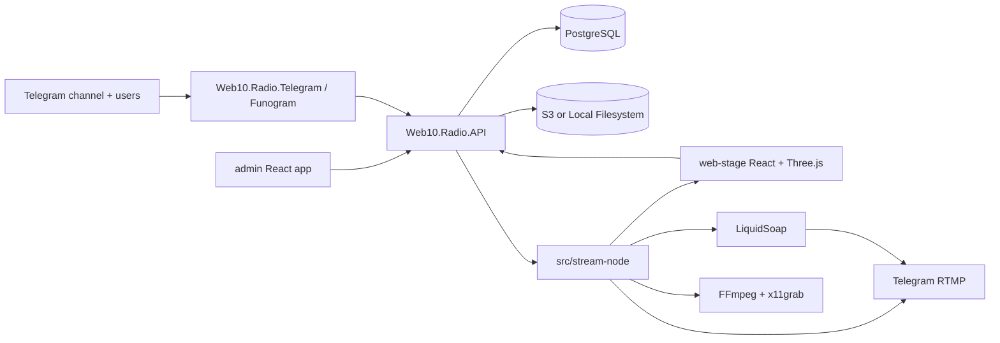

# Web10.Radio — SPEC

Web10.Radio — это 24/7 радио для Telegram-канала `https://t.me/netscapedidnothingwrong`. Целевое состояние v0: контейнеризованная система, где backend владеет сканированием библиотеки, программой воспроизведения, платежами, модерацией, metadata, состоянием очереди и координацией stream-node; frontend рендерит публичную сцену и admin cabinet; stream-node захватывает stage и audio pipeline и отправляет RTMP в Telegram.

## 1. Репозиторий сейчас

- Текущий репозиторий содержит только `README.md`, `.idea/`, `Web 1.0-radio-scene.zip` и `src/frontend/web-stage/mocks/`.
- Сейчас отсутствуют `docs/`, `src/backend/`, `src/frontend/admin/`, `src/stream-node/`.
- `src/frontend/web-stage/mocks/README.md` описывает HTML/CSS/JS как design handoff: визуал нужно faithfully recreate, но не копировать prototype structure в production runtime.
- `Web 1.0-radio-scene.zip` — duplicate wrapper вокруг тех же mock assets, а не отдельный источник требований.

## 2. Продуктовая цель

Web10.Radio должен работать как круглосуточная Telegram channel radio station с визуальной идентичностью Web 1.0 / Aero: полноэкранная 3D-сцена, ретро-окна, live overlay widgets, музыка из управляемой библиотеки и связь с аудиторией через Telegram bot. v0 покрывает track requests, paid screen messages, current-song lookup, donation/goal state, social links, playlists, metadata, storage configuration, moderation и stream health.

Метод оплаты v0 — Telegram Stars. Суммы в API и базе хранятся как integer Telegram Stars. USDT и card terminal фиксируются только как заметки для дорожной карты в этом SPEC; они не входят в v0 implementation checklists в `PLAN-FRONTEND.md` и `PLAN-BACKEND.md`.

## 3. Milestones для параллельной разработки

### Milestone FRONTEND — Claude

- [ ] Create Bun workspace under `src/frontend/` with workspaces `web-stage`, `admin`, and `shared`.
- [ ] Recreate the mock stage in `src/frontend/web-stage` using React + Three.js + strict TypeScript.
- [ ] Build `src/frontend/admin` as a React admin cabinet.
- [ ] Consume only `/api/v0/player/*` and `/api/v0/admin/*` contracts defined in this SPEC.
- [ ] Keep all domain contracts in `src/frontend/shared`; no JavaScript files, no `any`, no `unknown`, no untyped API payloads in authored source.
- [ ] Use Feature-Sliced Design layers `app`, `pages`, `widgets`, `features`, `entities`, `shared`; do not use the deprecated `processes` layer.

### Milestone BACKEND — ChatGPT/OMP

- [ ] Create F# solution `src/backend/Web10.Radio.sln`.
- [ ] Create projects `Web10.Radio.API`, `Web10.Radio.Telegram`, and `Web10.Radio.Database`.
- [ ] Implement ASP.NET API mounts `/api/v0/player/*`, `/api/v0/telegram/*`, `/api/v0/admin/*` as a modular monolith.
- [ ] Implement Funogram bot flows for Stars payments, `/request`, `/say`, `/song`, `/terms`, and `/paysupport`.
- [ ] Implement PostgreSQL persistence with ADO.NET only, SQL migrations, soft delete via `IsDeleted`, and pessimistic queue concurrency using `SELECT ... FOR UPDATE SKIP LOCKED`.
- [ ] Create `src/stream-node/` infrastructure for Xvfb + Chromium + LiquidSoap + FFmpeg pipeline that sends RTMP to Telegram.
- [ ] Package all runtime apps in Docker containers.

Frontend can start from the mock + SPEC DTOs immediately. Backend can start from SPEC contracts immediately. Integration begins when `/api/v0/player/state`, `/api/v0/player/events`, and admin auth assumptions are documented and kept stable.

### Phase S0 — Готовность контрактного пакета

- [ ] Keep `docs/SPEC.md` as the canonical source for product, architecture, contracts, and milestones.
- [ ] Keep `docs/PLAN-FRONTEND.md` consuming section names from this SPEC instead of duplicating private decisions.
- [ ] Keep `docs/PLAN-BACKEND.md` implementing the same `/api/v0/*` contracts without route drift.
- [ ] Validate that every payment, database, frontend, and stream-node invariant has one canonical home in this SPEC.

## 4. Архитектура системы



Архитектурные решения v0:

- Backend — modular monolith, not microservices: первая версия выигрывает от one deployable unit, in-process module boundaries и простых транзакций.
- `Web10.Radio.API` — ASP.NET host. Он владеет HTTP routes, background workers, configuration validation, DI composition, OTEL и health checks.
- `Web10.Radio.Telegram` — project/module для Telegram adapter logic на Funogram. В v0 он hosted by API process как module/hosted service или webhook handler; это не отдельный service, пока реализация не докажет необходимость.
- `Web10.Radio.Database` владеет migrations, SQL helpers, ADO.NET repositories, transaction helpers и database invariants.
- `src/stream-node/` — отдельный container/process group, потому что Chromium/Xvfb/LiquidSoap/FFmpeg требуют OS-level dependencies и process supervision.
- `src/frontend/web-stage` и `src/frontend/admin` — frontend workspaces внутри одного Bun monorepo.

## 5. Backend contract: HTTP API v0

Общие правила API:

- JSON content type: `application/json; charset=utf-8`.
- Все frontend-facing routes (`/api/v0/player/*`, `/api/v0/admin/*`) сериализуют JSON в camelCase — и имена полей, и enum-значения. Это фиксированный контракт для frontend (там принят camelCase). Внутренние PascalCase доменные состояния из БД (например `PlaybackQueue.Status`, `SayMessages.Status`, `StreamNodeHeartbeats.Status`) проецируются в camelCase на API-границе; frontend никогда не видит PascalCase и не видит внутренних состояний, которых нет в enum'ах ниже.
- Все timestamps — UTC ISO-8601 strings ending with `Z`.
- `amountStars`, `raisedStars`, `goalStars` — integer Telegram Stars, not cents.
- Public player routes read-only и unauthenticated, если deployment later не поставит их behind CDN/internal network.
- Все `/api/v0/admin/*` routes require the exact header contract `Authorization: Bearer <WEB10_ADMIN__TOKEN>` under named policy `Web10Admin`. Missing, malformed, multiple or wrong `Authorization` values return HTTP `401`, `WWW-Authenticate: Bearer`, and RFC 7807 code `admin.auth.required`; a valid token reaches the handler.
- Telegram webhook route validates Telegram secret token before accepting updates.
- REST errors use RFC 7807-style problem details with `traceId`, `code`, and `message` fields. Example shape: `{ "type": "https://web10.radio/problems/stream-unavailable", "title": "Stream unavailable", "status": 503, "traceId": "...", "code": "stream.unavailable", "message": "Stream is offline" }`.

### Player routes

| Method | Route | Purpose |
| --- | --- | --- |
| `GET` | `/api/v0/player/state` | Full stage state snapshot for `web-stage`. |
| `GET` | `/api/v0/player/events` | SSE stream for state deltas; frontend falls back to polling `/state`. |
| `GET` | `/api/v0/player/stream` | Public audio stream for web-stage playback; returns `503` with problem details when unavailable. |
| `GET` | `/api/v0/player/song` | Current track link payload used by `/song` and optional frontend display. |
| `GET` | `/api/v0/player/health` | Public/deploy health summary for stream state. |

`GET /api/v0/player/state` response shape:

```json
{
  "serverTimeUtc": "2026-07-07T00:00:00Z",
  "stream": {
    "status": "offline|starting|live|degraded",
    "publicAudioUrl": "/api/v0/player/stream",
    "rtmpRelay": "telegram",
    "bitrateKbps": 192,
    "startedAtUtc": "2026-07-07T00:00:00Z",
    "offlineReason": null
  },
  "nowPlaying": {
    "trackId": "uuid-v7",
    "title": "リサフランク420 / 現代のコンピュー",
    "artist": "Macintosh Plus",
    "album": "FLORAL SHOPPE",
    "source": "library|request|fallback",
    "externalUrl": "https://bandcamp.com/...",
    "coverImageUrl": "/api/v0/player/assets/cover/uuid-v7",
    "durationMs": 240000,
    "positionMs": 42000,
    "startedAtUtc": "2026-07-07T00:00:00Z"
  },
  "queue": {
    "currentQueueItemId": "uuid-v7",
    "items": [
      {
        "queueItemId": "uuid-v7",
        "trackId": "uuid-v7",
        "title": "Track title",
        "artist": "Artist",
        "source": "playlist|request|admin|fallback",
        "status": "queued|claimed|playing|played|failed"
      }
    ]
  },
  "donationGoal": {
    "title": "Цель сбора",
    "raisedStars": 3820,
    "goalStars": 5000,
    "topDonator": { "displayName": "CyberDove", "amountStars": 500 },
    "recent": [
      { "id": "uuid-v7", "displayName": "neonghost", "amountStars": 25, "paidAtUtc": "2026-07-07T00:00:00Z" }
    ]
  },
  "superChat": {
    "messages": [
      {
        "id": "uuid-v7",
        "displayName": "vhs_wanderer",
        "text": "this station literally saved my night shift",
        "amountStars": 100,
        "color": "#e0439a",
        "submittedAtUtc": "2026-07-07T00:00:00Z",
        "status": "approved"
      }
    ]
  },
  "socials": [
    {
      "id": "uuid-v7",
      "kind": "telegram|youtube|instagram|discord|external",
      "name": "Telegram",
      "handle": "@netscapedidnothingwrong",
      "url": "https://t.me/netscapedidnothingwrong",
      "glyph": "T",
      "color": "#2aabee",
      "qrImageUrl": "/api/v0/player/assets/social-qr",
      "isFeatured": true
    }
  ],
  "overlay": { "style": "aero|win9x", "layout": "corners|sidebar|bottombar" }
}
```

SSE route contract:

- Route: `GET /api/v0/player/events`.
- Event names: `player.state`, `player.queue`, `player.say`, `player.donation`, `player.health`.
- Data payload is the same object fragments as `/api/v0/player/state`.
- Client fallback: poll `/api/v0/player/state` every 5 seconds if SSE disconnects twice in 30 seconds.

### Telegram routes

| Method | Route | Purpose |
| --- | --- | --- |
| `POST` | `/api/v0/telegram/webhook` | Accept Telegram Bot API update webhook. |
| `GET` | `/api/v0/telegram/health` | Bot adapter health and last update id. |

В v0 Telegram ingestion работает только через webhook; long polling runtime не поставляется. Webhook требует ровно один `X-Telegram-Bot-Api-Secret-Token`, сравнивает его fixed-time, ограничивает body 1 MiB и принимает typed Funogram `Update`. Обычные команды/callbacks/`successful_payment` проходят durable inbox/outbox path; `pre_checkout_query` обрабатывается синхронно, потому что protocol acknowledgement нельзя ждать ordered relay.

### Stream-node callback routes

Эти routes internal-to-deployment и требуют exact `Authorization: Bearer <WEB10_STREAM__CALLBACK_TOKEN>` under policy `Web10StreamNode`; token не совпадает с admin token или Telegram RTMP key.

| Method | Route | Purpose |
| --- | --- | --- |
| `POST` | `/api/v0/stream-node/playback/{queueItemId}/lease` | Renew the active fenced playback lease. |
| `POST` | `/api/v0/stream-node/playback/{queueItemId}/completion` | Authoritatively finish active playback as played or failed. |

Lease body: `{ "claimOwner": "uuid-v7", "claimAttempt": 1 }`. Completion body adds `status: "played|failed"`; failed completion also requires non-empty `failureReason`. Body size is limited to 4096 bytes. Missing/wrong auth returns `401`; malformed/oversized body returns `400|413`; stale owner/attempt returns `409`; accepted callback returns `204`.

`PlaybackStarted` carries `queueItemId`, `claimOwner`, `claimAttempt`, `trackId` and `cachePath`. The stream-node renews its 30-second lease at least every 10 seconds while playback is active. Completion transaction fences `(queueItemId, claimOwner, claimAttempt, Playing)`, writes `Played|Failed`, and appends `PlaybackEnded` atomically. Expired attempts cannot renew or complete; the playback worker reclaims them after restart/crash.

### Admin routes

| Method | Route | Purpose |
| --- | --- | --- |
| `GET/PUT` | `/api/v0/admin/social-links` | Manage social links and QR/source metadata. |
| `GET/PUT` | `/api/v0/admin/donation-goal` | Manage donation goal title and target Stars. |
| `GET/POST` | `/api/v0/admin/playlists` | List/create playlists. |
| `GET/POST/PUT` | `/api/v0/admin/playlists/{playlistId}/items` | Manage playlist items and ordering. |
| `GET` | `/api/v0/admin/say-messages?status=pending|approved|rejected` | Moderate `/say` messages. |
| `POST` | `/api/v0/admin/say-messages/{messageId}/approve` | Approve a paid message for screen display. |
| `POST` | `/api/v0/admin/say-messages/{messageId}/reject` | Reject a paid message with moderation reason. |
| `GET/PUT` | `/api/v0/admin/storage` | Configure S3 or local filesystem library storage. |
| `POST` | `/api/v0/admin/library/scan` | Enqueue a library scan job. |
| `GET` | `/api/v0/admin/stream-node/status` | View stream-node process/heartbeat state. |
| `POST` | `/api/v0/admin/stream-node/restart` | Request stream-node restart through backend command event. |

Pinned `/say` moderation contract:

- `AdminSayMessageDto`: `{ id, telegramUserId, displayName, text, amountStars, color, status, submittedAtUtc, paidAtUtc, moderatedAtUtc, moderationReason }`. `telegramUserId` — nullable JSON number; absent `color`, timestamps и reason сериализуются как JSON `null`; `status` — exact lowercase `pending|approved|rejected`.
- `GET /api/v0/admin/say-messages` требует ровно одно lowercase query value `status=pending|approved|rejected`, возвращает не более 100 active rows в порядке `SubmittedAtUtc DESC, CreatedAtUtc DESC`; `pending` означает database state `PaidPendingModeration`. Invalid/missing/multiple status возвращает `400 say.status.invalid`.
- Approve принимает exact JSON `{}`; reject принимает exact `{ "reason": "..." }`, trims reason и требует 1–500 символов. Body limit обоих routes — 2 KiB.
- Invalid UUID/body/reason возвращает `400 say.request.invalid`; missing/deleted row — `404 say.not_found`; opposite или invalid state — `409 say.state_conflict`; first application и identical retry возвращают `204`.
- First moderation атомарно меняет `PaidPendingModeration -> Approved|Rejected` и append-ит `SayMessageModerated`. Approval сразу попадает в player state; rejection остается hidden. Связанный `Payments.Status` остается `Paid`; automatic refund не является частью этого route contract.

## 6. Event model вместо процедурных действий

Backend side effects model as events handled by in-process agents/queues, not as direct procedural chains. В v0 F# `MailboxProcessor` — in-process event handler primitive: он serializes mutable state updates through a message queue, упрощает reasoning about queue/payment/stream state и сохраняет transactional boundary в modular monolith.

Event envelope:

```json
{
  "eventId": "uuid-v7",
  "eventType": "TrackRequested",
  "occurredAtUtc": "2026-07-07T00:00:00Z",
  "producer": "Web10.Radio.Telegram",
  "correlationId": "uuid-v7",
  "causationId": "uuid-v7|null",
  "payload": {}
}
```

| Event type | Purpose |
| --- | --- |
| `TrackRequested` | Пользователь запросил трек через Telegram bot или admin action. |
| `TrackRequestMatched` | Запрос сопоставлен с track record или отправлен на admin review. |
| `SayMessageSubmitted` | `/say` message создана до оплаты или модерации. |
| `TelegramCommandReceived` | Bot получил informational `/start|help|song|terms|paysupport` command для localized workflow. |
| `TelegramCallbackReceived` | Bot получил request/song inline callback; owner/state guards выполняются до side effects. |
| `SayMessageModerated` | Admin approved/rejected paid screen message. |
| `DonationInvoiceCreated` | Backend создал Stars invoice для donation/request/say flow. |
| `DonationPaid` | Telegram прислал `successful_payment`; paid effect can proceed. |
| `PaymentRefunded` | Refund выполнен через Telegram Bot API. |
| `LibraryScanRequested` | Admin или system enqueue library scan job. |
| `TrackDiscovered` | Library scanner нашел audio file/metadata. |
| `PlaybackQueueItemClaimed` | Worker pessimistically claimed queue item. |
| `PlaybackStarted` | Playback state moved to current item. |
| `PlaybackEnded` | Track завершен или failed, queue advances. |
| `StreamNodeHeartbeatReceived` | Backend получил heartbeat от stream-node. |
| `StreamNodeFailureDetected` | Heartbeat/process state сигнализирует degradation/failure. |
| `AdminGoalChanged` | Donation goal changed by admin route. |
| `SocialLinkChanged` | Social link metadata changed by admin route. |

Duplicate Telegram updates are deduped by `(telegramUpdateId, eventType)` before event emission.

## 7. Telegram bot features

v0 localization поддерживает Russian и English. `User.language_code` со значением `ru` или prefix `ru-` выбирает Russian через ordinal-ignore-case comparison; отсутствующий tag и любое другое значение выбирают English.

Command contracts:

- `/start` — localized greeting and command list; `/help` — тот же список без greeting.
- `/request <query>` — private-chat paid request flow. Search выполняется в PostgreSQL через `pg_trgm`: transaction-local `pg_trgm.similarity_threshold = 0.30`, active tracks only, максимум пять rows. Normalized exact title или `artist — title` дает confident result только при единственном exact hit; без exact hit единственный fuzzy result confident при `similarity >= 0.70`; 2–5 rows становятся suggestions. Selection immutable и owner-guarded.
- Если `/request` дает zero rows или единственный result ниже `0.70`, backend сохраняет unpaid `TrackRequests.NeedsReview` backlog и сообщает, что automatic processing unavailable. До появления canonical admin mapping contract этот backlog не создает invoice и не попадает в playback queue.
- `/say <text>` — private-chat paid screen-message flow. Backend атомарно создает `SayMessages.PendingPayment`, payment order и durable invoice event; только `successful_payment` переводит message в `PaidPendingModeration`, а только admin approval — в public player state.
- `/song` без args возвращает current track best external link или `artist — title`; query mode использует тот же ranking contract и `sg:s:*` callbacks, но не создает payment/order.
- `/terms` и `/paysupport` возвращают localized Stars/payment support copy. Group invocation private-only commands получает localized private-chat instruction и не создает domain row, payment, invoice или keyboard.

Request/say prices являются required startup config, без runtime defaults: deployed v0 values — `WEB10_TELEGRAM__REQUEST_PRICE_STARS=100` и `WEB10_TELEGRAM__SAY_PRICE_STARS=50`. Измененная configuration value одновременно управляет localized copy, persisted `AmountStars`, pre-checkout validation и единственным `LabeledPrice.Amount`.

Telegram Stars payment rules:

- Digital goods/services используют exact currency `XTR`, `provider_token = ""` и ровно один positive price item. Invoice title/description/label — bounded fixed copy; raw track metadata и `/say` text в invoice не включаются.
- Request/say order creation, callback confirmation, inbox/outbox append и purpose transition idempotent. Telegram update dedupe key остается `(telegramUpdateId,eventType)`.
- `pre_checkout_query` bypasses outbox: linked internal deadline 8 секунд оставляет Telegram protocol limit 10 секунд с 2-second headroom. Validation требует matching user, payload, `XTR`, exact configured amount и live pending purpose; approval изменяет только `Payments.Status` на `PreCheckoutApproved`.
- Paid effect разрешен только после `successful_payment`: request атомарно становится `Paid` и создает одну queue row; say атомарно становится `PaidPendingModeration`. Identical replay — no-op success; mismatch terminally processed и не блокирует ordered outbox.
- Backend сохраняет `successful_payment.telegram_payment_charge_id`. B4 не вызывает `refundStarPayment`: rejected moderation сохраняет `Payments.Paid`, audit reason и направляет пользователя в `/paysupport`. Реальный refund остается отдельным future operational contract. USDT/card providers не входят в v0.

## 8. Database and persistence invariants

Persistence rules:

- PostgreSQL is the v0 database.
- Use ADO.NET only: no ORM in app persistence code, no EF Core, no Dapper, no object mapper.
- Use SQL migration files owned by `Web10.Radio.Database`.
- Migrations are implemented with FluentMigrator classes owned by `Web10.Radio.Database`.
- Migration versions are 12-digit Int64 values in YYYYMMDDmmss format; the first migration version is 202607080001.
- Schema upgrades run in a separate `Web10.Radio.Migrator` application/container before the API container is started or promoted.
- The API process never applies migrations during request-path startup; failed migration exits the migrator container non-zero.
- Use Dodo.Primitives `Uuid` for backend domain identifiers; generate RFC9562 UUIDv7 IDs for new domain objects and store them as PostgreSQL `uuid`.
- Every mutable table has `IsDeleted BOOLEAN NOT NULL DEFAULT false`, `CreatedAtUtc`, and `UpdatedAtUtc`.
- Application code never uses `DELETE` for domain data. Deletion means `UPDATE ... SET IsDeleted = true`.
- Read queries for mutable tables include `WHERE "IsDeleted" = false` unless the query is an admin audit query that explicitly asks for deleted rows.
- Indexes over active records should use partial predicates where appropriate: `WHERE "IsDeleted" = false`.
- Migration `202607100003` installs `pg_trgm`, two active expression GIN indexes for lowercased title and `artist — title`, and active unique indexes for invoice payload, payment purpose entity и playback request. Перед unique indexes migration fail-fast проверяет duplicate domain data с actionable errors и не исправляет его автоматически. Rollback удаляет эти пять indexes, но оставляет extension: `CREATE EXTENSION IF NOT EXISTS` не доказывает ownership.

First-version tables:

| Table | Purpose |
| --- | --- |
| `Tracks` | Canonical track metadata. |
| `TrackLinks` | External URLs such as Bandcamp, SoundCloud, YouTube, artist pages. |
| `TrackFiles` | Physical/local/S3 audio file metadata and cache paths. |
| `StorageBackends` | Local or S3 library source configuration metadata. |
| `Playlists` | Admin-managed playlists. |
| `PlaylistItems` | Ordered playlist membership. |
| `PlaybackQueue` | Playable queue for playlist, request, and admin items. |
| `TrackRequests` | Telegram/user requests and matching state. |
| `SayMessages` | Paid screen messages and moderation state. |
| `Payments` | Stars invoice/payment/refund records. |
| `DonationGoals` | Active and historical donation goal values. |
| `SocialLinks` | Social widgets, QR URLs, glyph/color metadata. |
| `LibraryScanJobs` | Scan job lifecycle and errors. |
| `StreamNodeHeartbeats` | Stream-node status samples and failure reasons. |
| `OutboxEvents` | Durable event records for side effects that must survive restarts. |
| `TelegramUpdateInbox` | Deduplication records for Telegram update ids and event types. |

Queue-claiming SQL pattern:

```sql
SELECT "Id"
FROM "PlaybackQueue"
WHERE "IsDeleted" = false
  AND "Status" = 'Queued'
ORDER BY "Priority" DESC, "RequestedAtUtc" ASC, "CreatedAtUtc" ASC
FOR UPDATE SKIP LOCKED
LIMIT 1;
```

The selected row is updated to `Claimed` in the same transaction before playback starts.

## 9. Configuration, secrets, DI, logging, OTEL

Обязательные для любого запуска configuration keys:

- `WEB10_POSTGRES__CONNECTION_STRING`
- `WEB10_TELEGRAM__BOT_TOKEN`
- `WEB10_TELEGRAM__WEBHOOK_SECRET`
- `WEB10_TELEGRAM__CHANNEL_ID_OR_USERNAME=@netscapedidnothingwrong`
- `WEB10_TELEGRAM__REQUEST_PRICE_STARS=100`
- `WEB10_TELEGRAM__SAY_PRICE_STARS=50`
- `WEB10_ADMIN__TOKEN`
- `WEB10_STREAM__RTMP_URL`
- `WEB10_STREAM__RTMP_KEY`
- `WEB10_STREAM__STAGE_URL`
- `WEB10_STREAM__CALLBACK_TOKEN`
- `WEB10_STORAGE__TYPE=Local|S3`
- `WEB10_OTEL__EXPORTER_OTLP_ENDPOINT`
- `WEB10_DATA_PROTECTION__KEY_RING_PATH`

Selected-storage contract:

- При `WEB10_STORAGE__TYPE=Local` обязателен `WEB10_STORAGE__LOCAL_ROOT`; `WEB10_STORAGE__S3_BUCKET`, `WEB10_STORAGE__S3_REGION`, `WEB10_STORAGE__S3_SERVICE_URL` и true-value `WEB10_STORAGE__S3_FORCE_PATH_STYLE` должны быть unset.
- При `WEB10_STORAGE__TYPE=S3` обязательны `WEB10_STORAGE__S3_BUCKET` и `WEB10_STORAGE__S3_REGION`; `WEB10_STORAGE__LOCAL_ROOT` должен быть unset.
- `WEB10_STORAGE__S3_SERVICE_URL` optional и, если задан, должен быть absolute `http`/`https` URI для S3-compatible service.
- `WEB10_STORAGE__S3_FORCE_PATH_STYLE` optional, принимает exact `true|false` и по умолчанию равен `false`; его включают для S3-compatible endpoints, которым нужен path-style addressing.
- S3 client uses the AWS SDK default credential chain. Region остается explicit signing region; при custom `WEB10_STORAGE__S3_SERVICE_URL` client также задает `AuthenticationRegion` из `WEB10_STORAGE__S3_REGION` и применяет configured path-style mode.
- `WEB10_STORAGE__TYPE` selects the default backend. An enabled non-default S3 `StorageBackends` row takes its bucket from PostgreSQL and resolves credentials and region through the standard AWS SDK provider chains (`AWS_REGION`/profile/workload metadata); this path does not reuse Local settings or require `WEB10_STORAGE__TYPE=S3`.
- S3 library scan paginates `ListObjectsV2` incrementally, renews the fenced scan-job lease before processing every page, filters supported audio extensions, records object key/size metadata and emits `TrackDiscovered`; it never materializes the full bucket listing in memory. Discovery does not download/cache the object: S3 tracks remain `CachePath=None`, `IsCached=false` until a separate cache path materializes them.

Реализованные startup validation rules:

- API агрегирует ошибки и fails before host build/port binding, если обязательный key отсутствует или пуст.
- `WEB10_POSTGRES__CONNECTION_STRING` парсится как Npgsql connection string.
- `WEB10_STREAM__RTMP_URL` разрешает только `rtmp`/`rtmps`; `WEB10_STREAM__STAGE_URL`, `WEB10_OTEL__EXPORTER_OTLP_ENDPOINT` и optional `WEB10_STORAGE__S3_SERVICE_URL` — только absolute `http`/`https` URI.
- Telegram bot token, webhook secret и channel id/username проверяются синтаксически; `WEB10_STREAM__RTMP_KEY` должен быть nontrivial whitespace-free secret минимум из 16 символов, а `WEB10_STREAM__CALLBACK_TOKEN` и `WEB10_ADMIN__TOKEN` — bearer-safe secrets минимум из 24 символов с exact alphabet `A-Za-z0-9_-`.
- Telegram request/say price keys parse invariant positive `Int32`; missing, non-integer, overflow, zero или negative value fails startup с exact `<KEY> must be a positive 32-bit integer.`
- Local storage root и Data Protection key-ring path проверяются как creatable/writable directories; S3 bucket, region и взаимоисключающие Local/S3 fields проверяются до `Build()`.
- Telegram token, stream callback token, admin token и RTMP key являются config/Docker secrets, а не database rows. Если later admin feature хранит secrets в PostgreSQL, payload защищается ASP.NET Core Data Protection, а key ring сохраняется вне container filesystem.

Правила Container/Docker Compose:

- Docker images не должны быть Alpine/libmusl based. Для non-.NET infrastructure используются Debian/Ubuntu-based images, даже если они больше.
- .NET final/runtime images используют Microsoft .NET chiseled variants. Текущие backend runtime tags используют `10.0-noble-chiseled`; SDK build stages остаются на официальных non-Alpine SDK images, потому что Microsoft не публикует chiseled SDK images.
- `compose.yaml` — текущий backend infrastructure smoke path: PostgreSQL `postgres:17`, one-shot `Web10.Radio.Migrator`, затем `Web10.Radio.API`.
- Compose smoke explicitly supplies request/say prices `100`/`50`; production также обязана задать оба keys и не получает runtime default.
- Compose startup order: PostgreSQL healthcheck → migrator successful completion → API startup and API liveness healthcheck. Bounded `docker compose up --wait --wait-timeout` возвращает success только после healthy API; ad hoc `sleep` не входит в smoke contract.
- В chiseled API container healthcheck выполняет exact managed command `dotnet Web10.Radio.API.dll --health-check http://127.0.0.1:8080/health/live`; image не предполагает наличие shell, `curl` или `wget`, а probe exit code отражает HTTP success.
- Текущий compose smoke намеренно не закрывает full v0 Compose target с frontend, stream-node и observability collector; это остается для later Docker verification phase.

DI rules aligned with ASP.NET lifecycle:

- До `builder.Build()` service-registration chain имеет порядок: Database → application services → Telegram adapter → background workers → API authentication/authorization services → health checks → observability.
- После `Build()` вызываются `UseAuthentication()` и `UseAuthorization()`, затем отдельно mapping-ятся health endpoints и `/api/v0/*` endpoints; endpoint mapping не является DI registration stage.
- Use constructor injection, not service locator.
- Use scoped repositories/transactions for request work.
- Do not inject scoped services into singletons without an explicit scope factory.

Logging/OTEL rules:

- Use high-performance logging with `LoggerMessageAttribute`/source-generated logging or equivalent F# wrapper over source-generated partial methods where implemented in C# support code; no string interpolation in hot-path log calls.
- Include `traceId`, `correlationId`, `eventId`, `telegramUpdateId`, and `queueItemId` where applicable.
- Emit OTEL traces and metrics for API requests, Telegram updates, queue claims, library scans, stream-node heartbeats, and payment flow.

## 10. Frontend architecture contract

Frontend paths:

- `src/frontend/package.json` — Bun workspace root with workspaces `web-stage`, `admin`, `shared`.
- `src/frontend/tsconfig.base.json` — strict base config.
- `src/frontend/shared/` — shared domain contracts, API clients, tokens.
- `src/frontend/web-stage/` — public React + Three.js player scene.
- `src/frontend/web-stage/mocks/` — keep existing mock bundle as reference assets.
- `src/frontend/admin/` — React admin cabinet.

TypeScript rules:

- `strict: true` is mandatory.
- Authored source uses `.ts`/`.tsx` only; no `.js`.
- No `any`, no `unknown`, no untyped API payloads, no type assertions that erase domain types.
- Every known payload uses named domain types from `src/frontend/shared`.
- FSD import direction is from higher layers to lower layers only; `shared` imports no project domains.

Web-stage visual invariants from the mock:

- Fullscreen canvas background.
- Loading window `web1radio.exe` until scene ready.
- NOW PLAYING widget.
- DONATION GOAL widget.
- SUPER CHAT widget.
- FOLLOW US widget with QR and featured social.
- Donation toast.
- Themes `aero` and `win9x`.
- Layouts `corners`, `sidebar`, `bottombar`.
- WebGL context loss/restoration, resize handling, mouse parallax, requestAnimationFrame lifecycle, and resource cleanup.

## 11. stream-node contract

`src/stream-node/` is its own runtime area with these responsibilities:

- Start Xvfb display for headless Chromium.
- Start Chromium in kiosk mode pointed at the deployed `web-stage` URL and include `--enable-unsafe-swiftshader` because software WebGL is required in the stream container.
- Run LiquidSoap script that builds the audio/video stream graph, reads backend metadata/queue state, and produces a Telegram-compatible RTMP output.
- Use FFmpeg/x11grab to capture the Chromium/X11 stage video.
- Mix video from Chromium with audio selected from backend metadata/cache.
- Push to Telegram RTMP using `WEB10_STREAM__RTMP_URL` and `WEB10_STREAM__RTMP_KEY`.
- Report heartbeat/failure status to backend.

Failure states: `Starting`, `Live`, `Degraded`, `Restarting`, `Failed`, `Offline`. Restart policy uses bounded retries with surfacing to admin after the retry window, not silent infinite restart.

## 12. Testing and acceptance

Integration tests are preferred over unit tests because v0 risk sits at contracts, database concurrency, Telegram payment state, and process boundaries. Required test/check areas:

- API contract tests for `/api/v0/player/state`, `/api/v0/player/events`, admin moderation routes, and Telegram webhook parsing.
- Database integration tests for migrations, soft delete filtering, and `SELECT ... FOR UPDATE SKIP LOCKED` queue claiming.
- Telegram command tests for `/request`, `/say`, `/song`, Stars pre-checkout, successful payment, duplicate update dedupe, `/terms`, `/paysupport`.
- stream-node smoke checks for Xvfb, Chromium, LiquidSoap, FFmpeg availability, and heartbeat reporting.
- frontend checks for strict TypeScript, no JavaScript, no `any`/`unknown`, scene cleanup, and API fallback behavior.
- Docker smoke path: PostgreSQL + API + frontend + stream-node start and health endpoints become green.
